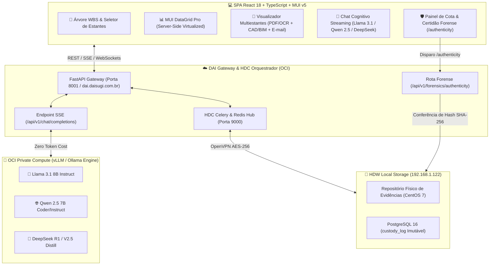

# 📱 Especificação Técnica do Front-End: DAI Smart Reception × Chat LLM

**Ecossistema:** Daisugi Tecnologias  
**Documento:** `DAI_FRONTEND_INTERFACE_E_CHAT_LLM.md`  
**Público-Alvo:** Engenheiros Front-End (React 18 / TypeScript / Material-UI v5), Designers de Produto (UI/UX) e Especialistas em Acessibilidade e Performance Web.  
**Versão:** `v2.0.0` (Arquitetura Soberana OCI & HDC/HDW)  
**Data:** Outubro de 2026  
**Status:** 🚀 **HOMOLOGADO PARA DESENVOLVIMENTO & PRODUÇÃO**

---

## 1. Visão Geral da Interface & Objetivos de Produto

A **DAI Smart Reception** evoluiu de um modelo receptivo básico para uma **Single Page Application (SPA) Enterprise de Triagem Forense e Atendimento Cognitivo Inteligente**. 

Esta especificação define a arquitetura dos componentes visuais, padrões de estado global, streaming de mensagens com LLMs soberanos hospedados na Oracle Cloud Infrastructure (OCI) a **custo zero de tokens**, e integração com o visualizador multiestantes com auditoria criptográfica.



---

## 2. Telas da SPA: Navegação WBS, Seletor de Estantes & DataGrid

### 2.1. Arquitetura da Árvore WBS (`obra_wbs`)
A estrutura organizacional de empreendimentos imobiliários e patrimoniais da SUGOI é hierarquizada sob o padrão WBS (*Work Breakdown Structure*):
`[EMPREENDIMENTO] > [FASE / TORRE] > [PAVIMENTO / ÁREA] > [DISCIPLINA / PACOTE]`.

Componente React: `<WbsTreeNavigator />` construído sobre `@mui/x-tree-view` com carregamento sob demanda (*lazy-loading node expansion*).

```typescript
// src/types/wbs.ts
export interface WbsNode {
  id: string; // Ex: "WBS-SUG-014-T1-SUB"
  label: string; // Ex: "Torre A - Subsolo Técnico"
  nivel: number;
  codigoWbs: string;
  empreendimentoId: string;
  totalDocumentos: number;
  hasChildren: boolean;
  sigilo: 'PUBLICO' | 'INTERNO' | 'RESTRITO' | 'CONFIDENCIAL_PAM';
}
```

### 2.2. Seletor de Estantes Virtuais
O seletor de estantes organiza os documentos segundo as diretrizes de governança física e digital do ecossistema:

| Código | Estante | Tipo de Arquivo / Finalidade |
| :--- | :--- | :--- |
| `EST-01` | **Projetos & As-Built** | Plantas CAD (`.dwg`), Modelos BIM (`.ifc`), memoriais descritivos (`.pdf`). |
| `EST-02` | **Licenciamento & Jurídico** | Alvarás, Habite-se, Matrículas, Laudos Periciais, Certidões. |
| `EST-03` | **Financeiro & Contábil** | Notas Fiscais, Medições de Empreiteiros, Comprovantes Bancários, SPED. |
| `EST-04` | **Correspondências & E-mails** | Mensagens corporativas (`.eml`, `.msg`), notificações extrajudiciais. |
| `EST-05` | **Diários de Obra & Ensaios** | RDOs digitalizados com OCR, ensaios de rompimento de concreto, fotos com geotag. |

### 2.3. Tabela Dinâmica de Alta Performance (`MUI DataGrid Pro`)
Para renderizar mais de 50.000 registros sem travamento de interface no navegador, adota-se o `@mui/x-data-grid-pro` com:
1. **Virtualização Bidirecional**: Renderização exclusiva das linhas visíveis na tela.
2. **Server-Side Pagination & Sorting**: Repasse de filtros ao back-end via parâmetros `skip`, `limit`, `sort_by` e `filter_query`.
3. **Chip de Sigilo Dinâmico**: Badges coloridos de controle de acesso (Verde = Público, Amarelo = Interno, Vermelho = Restrito PAM).

```tsx
// src/components/DataGrid/ForenseDataGrid.tsx
import React, { useState, useEffect } from 'react';
import { DataGridPro, GridColDef, GridRenderCellParams } from '@mui/x-data-grid-pro';
import { Chip, Tooltip, IconButton, Box } from '@mui/material';
import VerifiedIcon from '@mui/icons-material/Verified';
import VisibilityIcon from '@mui/icons-material/Visibility';

export const ForenseDataGrid: React.FC<{ wbsId: string; estanteId: string }> = ({ wbsId, estanteId }) => {
  const [rows, setRows] = useState([]);
  const [loading, setLoading] = useState(false);
  const [rowCount, setRowCount] = useState(0);
  const [paginationModel, setPaginationModel] = useState({ page: 0, pageSize: 25 });

  const columns: GridColDef[] = [
    { field: 'cota_documento', headerName: 'Cota Determinística', width: 220, 
      renderCell: (params: GridRenderCellParams) => (
        <span style={{ fontFamily: 'monospace', fontWeight: 600 }}>{params.value}</span>
      )
    },
    { field: 'nome_arquivo', headerName: 'Documento / Arquivo', flex: 1, minWidth: 260 },
    { field: 'tipo_extensao', headerName: 'Tipo', width: 90 },
    { field: 'hash_sha256', headerName: 'Hash SHA-256 (Truncado)', width: 170,
      renderCell: (params: GridRenderCellParams) => (
        <Tooltip title={params.value}>
          <span style={{ fontFamily: 'monospace', color: '#6b7280' }}>
            {params.value ? `${params.value.substring(0, 10)}...${params.value.substring(58)}` : '-'}
          </span>
        </Tooltip>
      )
    },
    { field: 'sigilo', headerName: 'Classificação', width: 130,
      renderCell: (params: GridRenderCellParams) => {
        const color = params.value === 'CONFIDENCIAL_PAM' ? 'error' : params.value === 'RESTRITO' ? 'warning' : 'success';
        return <Chip label={params.value} color={color} size="small" variant="outlined" />;
      }
    },
    { field: 'acoes', headerName: 'Ações Forenses', width: 120, sortable: false,
      renderCell: (params: GridRenderCellParams) => (
        <Box>
          <IconButton size="small" title="Visualizar Evidência" onClick={() => abrirViewer(params.row)}>
            <VisibilityIcon fontSize="small" />
          </IconButton>
          <IconButton size="small" color="primary" title="Emitir Certidão Forense" onClick={() => validarAutenticidade(params.row)}>
            <VerifiedIcon fontSize="small" />
          </IconButton>
        </Box>
      )
    }
  ];

  return (
    <Box sx={{ height: 650, width: '100%' }}>
      <DataGridPro
        rows={rows}
        columns={columns}
        rowCount={rowCount}
        loading={loading}
        paginationMode="server"
        paginationModel={paginationModel}
        onPaginationModelChange={setPaginationModel}
        disableRowSelectionOnClick
      />
    </Box>
  );
};
```

---

## 3. Visualizador Multiestantes: PDFs, CAD/BIM e E-mails

O visualizador embutido foi projetado para auditoria forense sem necessidade de download do arquivo em disco local, evitando vazamentos acidentais.

### 3.1. Leitor Embutido de PDFs com Highlights OCR em Amarelo
- Baseado em `react-pdf` (`pdfjs-dist`) com camada vetorial de anotação de texto (*TextLayer*).
- Quando o usuário ou a IA localiza um termo pericial (ex: *"Cláusula 12"*, *"Desapropriação"*, *"Infiltração Pavimento 2"*), as coordenadas de caixa delimitadora (*bounding box* extraídas via OCR Tesseract / PyMuPDF no backend) são renderizadas como `rect` em overlay CSS amarelo translúcido (`rgba(253, 224, 71, 0.45)`).
- Suporte a zoom vetorial, rotação e navegação por miniaturas.

### 3.2. Visualizador Técnico CAD (`.dwg`) & BIM (`.ifc`)
- **Arquivos DWG**: Convertidos sob demanda no backend para SVG vetorial ou consumidos via `webgl-cad-viewer` (WebGL 2.0 com suporte a camadas/layers desligáveis).
- **Modelos BIM IFC**: Renderizados via **web-ifc-viewer** (Three.js / WebAssembly) permitindo órbita 3D, isolamento de componentes estruturais, inspeção de propriedades IFC (*IfcBeam*, *IfcWall*, *IfcFlowTerminal*) e medição de distâncias diretamente na janela da SPA.

### 3.3. Visualizador de E-mails Corporativos (`.eml` / `.msg`)
- Renderizador de corpo HTML sanitizado com `DOMPurify` para neutralizar scripts maliciosos e pixels de rastreamento.
- Exibição de cabeçalhos técnicos de autenticidade:
  - `DKIM-Signature`, `SPF`, `DMARC`, `Message-ID`, `X-Originating-IP` e carimbo UTC de envio/recebimento.
- Painel de anexos com cálculo imediato do hash SHA-256 de cada anexo antes do clique.

---

## 4. Chat com LLM Open Source Soberano na OCI (Custo Zero de Tokens)

A DAI elimina a dependência financeira e jurídica de APIs proprietárias pagas por token (OpenAI, Anthropic) para operações de consulta confidencial, executando modelos livres dentro da infraestrutura privada da Oracle Cloud (OCI).

### 4.1. Modelos Homologados no Cluster OCI

| Modelo | Parâmetros | Quantização | Função Primária |
| :--- | :--- | :--- | :--- |
| **Meta Llama 3.1** | `8B-Instruct` | `AWQ 4-bit` / `FP16` | Atendimento geral, interpretação de regras contratuais e síntese de relatórios. |
| **Qwen 2.5** | `7B-Instruct` | `GPTQ 4-bit` / `FP16` | Raciocínio estruturado, extração de tabelas, análise de cronogramas e JSON. |
| **DeepSeek R1 / V2.5** | `7B/14B Distill` | `AWQ 4-bit` | Raciocínio forense em cadeia de pensamentos (*Chain of Thought* - CoT) e laudos periciais. |

### 4.2. Streaming Server-Sent Events (SSE) com React Hooks
A comunicação cliente-servidor utiliza `fetch` com leitor de streams (`ReadableStreamDefaultReader`) para exibir os tokens em tempo real na interface, com suporte a cancelamento de requisição via `AbortController`.

```tsx
// src/hooks/useDaiLlmChat.ts
import { useState, useRef } from 'react';

export const useDaiLlmChat = (wbsContextId: string) => {
  const [messages, setMessages] = useState<Array<{ role: string; content: string; reasoning?: string }>>([]);
  const [isGenerating, setIsGenerating] = useState(false);
  const abortControllerRef = useRef<AbortController | null>(null);

  const sendMessage = async (promptText: string, modelo: 'llama-3.1' | 'qwen-2.5' | 'deepseek') => {
    setIsGenerating(true);
    abortControllerRef.current = new AbortController();

    const newMessages = [...messages, { role: 'user', content: promptText }];
    setMessages(newMessages);

    try {
      const response = await fetch('/api/v1/chat/completions/stream', {
        method: 'POST',
        headers: { 'Content-Type': 'application/json' },
        body: JSON.stringify({
          model: modelo,
          wbs_id: wbsContextId,
          messages: newMessages,
          temperature: 0.1, // Baixa temperatura para garantir determinismo pericial
        }),
        signal: abortControllerRef.current.signal,
      });

      const reader = response.body?.getReader();
      const decoder = new TextDecoder('utf-8');
      let assistantResponse = '';

      while (reader) {
        const { done, value } = await reader.read();
        if (done) break;

        const chunk = decoder.decode(value, { stream: true });
        const lines = chunk.split('\n').filter(line => line.trim().startsWith('data: '));

        for (const line of lines) {
          const payload = line.replace('data: ', '').trim();
          if (payload === '[DONE]') break;
          const parsed = JSON.parse(payload);
          assistantResponse += parsed.choices[0]?.delta?.content || '';
          
          setMessages(prev => [
            ...prev.slice(0, -1),
            { role: 'assistant', content: assistantResponse }
          ]);
        }
      }
    } catch (err: any) {
      if (err.name !== 'AbortError') {
        console.error('Falha no streaming do LLM Soberano:', err);
      }
    } finally {
      setIsGenerating(false);
    }
  };

  const stopGeneration = () => {
    abortControllerRef.current?.abort();
    setIsGenerating(false);
  };

  return { messages, sendMessage, isGenerating, stopGeneration };
};
```

---

## 5. Painel da Cota & Certidão Forense (`/authenticity`)

### 5.1. Mecânica de Validação de Integridade
Ao clicar no botão `🛡️ Validar Autenticidade Forense` presente em qualquer registro documental:
1. A SPA emite chamada `POST /api/v1/forensics/authenticity` com a `cota_documento` e o `item_id`.
2. O HDC comanda o HDW local para reler o arquivo binário direto do disco (`192.168.1.122`), recalculando o hash SHA-256 em blocos de 1 MiB.
3. O hash recalculado é comparado contra o registro da tabela `custody_log` do PostgreSQL.
4. Se o hash coincidir: Status **INTEGRIDADE_CONFIRMADA** (Certidão emitida com carimbo UTC e assinatura digital).
5. Se houver discrepância: Status **ALERTA_DE_VIOLAÇÃO** com disparo de quarentena automática no sistema de compliance.

### 5.2. Modal de Certidão Pericial
A SPA exibe o modal `<CertidaoPericialModal />` contendo:
- **Cota Determinística:** `EST01-WBS014-2026-F4B27A9C`
- **Hash SHA-256 Registrado:** `e3b0c44298fc1c149afbf4c8996fb92427ae41e4649b934ca495991b7852b855`
- **Hash SHA-256 Recalculado:** `e3b0c44298fc1c149afbf4c8996fb92427ae41e4649b934ca495991b7852b855`
- **Delta:** `0 bytes / 0 alterações detectadas (100% Autêntico)`
- **Operador Responsável:** `Dr. Taylor / Auditoria Forense Daisugi`
- **Ações:** `[Imprimir Certidão PDF com QR Code]` e `[Copiar Prova Criptográfica]`.

---

## 6. Checklist de Qualidade de Interface & Performance (CWV)
- [x] **Largest Contentful Paint (LCP):** < 1.8 segundos em conexões 4G/Banda Larga corporativa.
- [x] **Interaction to Next Paint (INP):** < 120 ms no MUI DataGrid e no leitor de PDF.
- [x] **Cumulative Layout Shift (CLS):** 0.00 com esqueletos de carregamento (*MUI Skeleton*).
- [x] **Acessibilidade (WCAG 2.1 AA):** Suporte total a navegação por teclado e leitores de tela com atributos `aria-label` e `role="region"`.
