# 🔌 Documentação Oficial de Integração: Front-End & Back-End (DAI Framework)

Esta documentação estabelece o contrato formal de integração, comunicação REST, modelo de estados e fluxos de dados entre a interface de usuário (**Front-End / Lobby Mobile-First** em `app_chat_st.py`) e o motor de inteligência e segurança (**Back-End FastAPI Assíncrono** em `api_backend.py`).

---

## 1. Visão Geral da Arquitetura de Comunicação

O Front-End foi desenhado como um cliente desacoplado (Stateless no protocolo, mas reativo no `st.session_state`). Ele nunca executa cálculos pesados, queries SQL ou vetorização de embeddings internamente; toda a inteligência é delegada para o Back-End via chamadas HTTP JSON.

```
┌──────────────────────────────────────┐             HTTP REST / JSON             ┌──────────────────────────────────────┐
│         FRONT-END (LOBBY)            │ ───────────────────────────────────────> │          BACK-END (API)              │
│         `app_chat_st.py`             │ <─────────────────────────────────────── │         `api_backend.py`             │
│    Porta: 8501 (Mobile / Desktop)    │      Porta: 8001 (FastAPI / Uvicorn)     │  Cache O(1), PGVector, RBAC, Gemini  │
└──────────────────────────────────────┘                                          └──────────────────────────────────────┘
```

### Configuração de Endpoint Dinâmico
A comunicação entre o Front-End e o Back-End é parametrizada via variável de ambiente:
* **Variável:** `DAI_API_URL`
* **Padrão em Desenvolvimento:** `http://localhost:8001`
* **Padrão em Produção (Docker OCI):** `http://dai_backend:8001` (comunicação interna na rede Docker) ou `https://dai.daisugi.com.br/api` (via Caddy Gateway).

---

## 2. Diagrama de Sequência dos 4 Fluxos Centrais

```mermaid
sequenceDiagram
    autonumber
    actor U as Usuário / Especialista
    participant F as Front-End (Lobby Dai)
    participant B as Back-End (FastAPI)
    participant R as Cache Redis O(1)
    participant DB as PostgreSQL + pgvector
    participant K as Kan-sa / Hudson (Assíncrono)

    %% FLUXO 1: LOGIN
    rect rgb(20, 30, 45)
    note right of U: Fluxo 1: Autenticação & Injeção de Salas
    U->>F: Digita usuário e senha na Portaria
    F->>B: POST /auth/login {usuario, senha}
    B->>DB: Consulta permissões, roles e salas liberadas
    B-->>F: HTTP 200 {autenticado, id, token_jwt, salas_liberadas}
    F->>F: Grava dados no st.session_state e libera o Lobby
    end

    %% FLUXO 2: TRIAGEM E CACHE
    rect rgb(25, 40, 30)
    note right of U: Fluxo 2: Triagem no Chat com Proteção de Cache
    U->>F: Envia queixa no chat ("A internet da filial caiu")
    F->>B: POST /chat/triage {id_usuario, texto_usuario}
    B->>R: Verifica hash MD5 da queixa
    alt Cache Hit (Dor repetida)
        R-->>B: Retorna destino previamente validado
        B-->>F: HTTP 200 {resposta_dai, laudo, cache_hit: true}
    else Cache Miss (Dor nova)
        B->>DB: Busca semântica L2 (<->) via pgvector
        B-->>F: HTTP 200 {resposta_dai, laudo, cache_hit: false}
    end
    F->>U: Renderiza mensagem da Dai e atualiza aba do Laudo
    end

    %% FLUXO 3: APRENDIZADO
    rect rgb(35, 25, 45)
    note right of U: Fluxo 3: Fechamento de Ticket & Aprendizado
    U->>F: Especialista preenche resolução e clica em Gravar
    F->>B: POST /triage/learn {texto, destino, resolucao, is_global}
    B->>DB: Gera embedding e grava na memória do cliente / global
    B-->>F: HTTP 200 {status: "sucesso", mensagem: "A Dai evoluiu..."}
    F->>U: Feedback visual de sucesso
    end

    %% FLUXO 4: QUARENTENA ASSÍNCRONA
    rect rgb(45, 25, 25)
    note right of U: Fluxo 4: Validação de Quarentena de Risco (RBAC)
    U->>F: Operador aprova hash de documento/CCB
    F->>B: POST /api/quarentena/validar [Bearer Token JWT]
    B->>B: Valida claim 'role: operator'
    B->>K: Dispara Background Task para o Kan-sa / Hudson
    B-->>F: HTTP 202 Accepted (Sem travar o navegador)
    F->>U: Notificação imediata: "Laudo em processamento"
    end
```



---

## 3. Especificação dos Contratos de Comunicação

### 3.1. Handshake de Autenticação (`POST /auth/login`)
Disparado na tela de Portaria. É a primeira requisição do Front-End.

* **Requisição enviada pelo Front-End:**
  ```json
  {
    "usuario": "admin",
    "senha": "123"
  }
### 3.1. Handshake de Autenticação (`POST /auth/login`)
Disparado na tela de Portaria. É a primeira requisição do Front-End.

#### Implementação no Front-End (`app_chat_st.py`):
```python
res = requests.post(f"{API_BASE_URL}/auth/login", json={"usuario": usuario, "senha": senha}, timeout=5)
if res.status_code == 200:
    dados = res.json()
    st.session_state.autenticado = True
    st.session_state.paciente_id = dados.get("id_usuario", 1)
    st.session_state.paciente_nome = dados.get("nome", "Usuário")
    st.session_state.paciente_perfil = dados.get("perfil", "Desconhecido")
    st.session_state.salas_liberadas = dados.get("salas_liberadas", [])
    st.session_state.token_jwt = dados.get("token_jwt", "")
    st.rerun()
```

#### Implementação no Back-End (`api_backend.py`):
```python
@app.post("/auth/login", response_model=LoginResponse)
def login(request: LoginRequest):
    if request.usuario.lower() == 'admin' and request.senha == '123':
        return LoginResponse(
            autenticado=True, id_usuario=1, nome="Administrador Operador", perfil="admin",
            salas_liberadas=[Sala(nome="Painel Quarentena", funcao="Validação de Risco", cor="#EF4444")],
            clientes_acesso=["1", "2"],
            token_jwt="token_jwt_operador_secreto"
        )
    raise HTTPException(status_code=401, detail="Credenciais inválidas.")
```

---

### 3.2. Triagem e Roteamento Fuzzy (`POST /chat/triage`)
Disparado a cada mensagem enviada pelo usuário no campo `st.chat_input`.

#### Implementação no Front-End (`app_chat_st.py`):
```python
res = requests.post(f"{API_BASE_URL}/chat/triage", json={
    "texto_usuario": prompt,
    "id_usuario": st.session_state.get("paciente_id", 1)
}, timeout=5)

if res.status_code == 200:
    dados = res.json()
    st.session_state.laudo_final = dados["laudo_final"]
    texto_resposta = dados["resposta_dai"]
    if dados.get("cache_hit"):
        texto_resposta = f"⚡ **[Cache Redis O(1) Hit]**\n\n{texto_resposta}"
    st.markdown(texto_resposta)
```

#### Implementação no Back-End (`api_backend.py`):
```python
@app.post("/chat/triage", response_model=TriageResponse)
def triage(request: TriageRequest):
    prompt = request.texto_usuario.strip()
    hash_prompt = hashlib.md5(prompt.encode()).hexdigest()
    
    # 1. Checagem em Cache O(1)
    if hash_prompt in REDIS_CACHE_MOCK:
        cache = REDIS_CACHE_MOCK[hash_prompt]
        return TriageResponse(
            status_fuzzy=False, destino=cache["destino"], cliente_destino=cache["cliente_destino"],
            resposta_dai=f"⚡ (Via Cache) Encaminhando para **{cache['destino']}**.",
            laudo_final="✅ Triagem via Cache Redis O(1).", cache_hit=True
        )
    
    # 2. RAG Vetorial + Trava Fuzzy
    # Se distância < 0.3 -> conclui e grava em cache. Se >= 0.3 -> Protocolo de 3 Perguntas.
```

---

### 3.3. Painel de Quarentena e Desacoplamento (`POST /api/quarentena/validar`)
Acessível exclusivamente quando `st.session_state.paciente_perfil == "admin"` na Aba **"🚪 Salas e Corredores"**.

#### Implementação no Front-End (`app_chat_st.py`):
```python
headers = {"Authorization": f"Bearer {st.session_state.get('token_jwt', '')}"}
res = requests.post(
    f"{API_BASE_URL}/api/quarentena/validar",
    headers=headers,
    json={"hash_id_documento": hash_doc, "aprovado": True},
    timeout=5
)
if res.status_code == 202:
    st.success("✅ Solicitação aceita em segundo plano (HTTP 202 Accepted).")
```

#### Implementação no Back-End (`api_backend.py`):
```python
@app.post("/api/quarentena/validar")
def validar_quarentena(
    request: QuarentenaRequest, 
    bg_tasks: BackgroundTasks, 
    is_operator: bool = Depends(verify_operator_role)
):
    bg_tasks.add_task(processar_auditoria_kansa_async, request.hash_id_documento, request.aprovado)
    return {
        "status_http": 202,
        "message": "Solicitação aceita. O Kan-sa assumiu a tarefa em segundo plano.",
        "hash_processado": request.hash_id_documento
    }
```

---

### 3.4. Ciclo de Aprendizado e Retroalimentação (`POST /triage/learn`)
Disponível na Aba **"📋 Seu Contexto (Ticket/Laudo)"** para encerramento de chamado por especialista.

#### Implementação no Front-End (`app_chat_st.py`):
```python
res_learn = requests.post(
    f"{API_BASE_URL}/triage/learn",
    json={
        "texto_usuario": queixa_orig,
        "destino_final": sala_destino,
        "cliente_destino": "controladoria",
        "resolucao_especialista": resolucao_esp,
        "is_global": is_global
    },
    timeout=5
)
if res_learn.status_code == 200:
    st.success(res_learn.json().get("mensagem"))
```

#### Implementação no Back-End (`api_backend.py`):
```python
@app.post("/triage/learn", response_model=FeedbackResponse)
def aprender_com_triagem(request: FeedbackRequest):
    texto = f"Queixa: {request.texto_usuario} | Resolução: {request.resolucao_especialista}"
    vetor = embedder.embed_query(texto)
    # Grava no PostgreSQL na memoria_global_daisugi ou memoria_{cliente}
    return FeedbackResponse(status="sucesso", mensagem="A Dai evoluiu. Nova trilha sináptica criada.")
```

---

## 4. Testes de Integração Automatizados (E2E)

Para garantir que a integração nunca quebre em novos deploys, o projeto conta com uma suíte de testes de integração automatizada em `test_integration_e2e.py` que pode ser executada localmente ou em pipelines de CI/CD:

```bash
python test_integration_e2e.py
```

### O que a suíte valida:
1. **Healthcheck:** Testa se a API está operacional e pronta para tráfego (`GET /health`).
2. **Autenticação:** Testa login com credenciais corretas e bloqueio de credenciais inválidas (`POST /auth/login`).
3. **Triagem & Cache O(1):** Testa a primeira chamada (Cache Miss) e a segunda chamada imediata comprovando o `cache_hit: true`.
4. **Proteção Anti-Alucinação Fuzzy:** Valida o acionamento do Protocolo de 3 Perguntas diante de entradas ambíguas.
5. **Segurança RBAC (Anti-Privilege Escalation):** Comprova que tokens sem permissão tomam `HTTP 403 Forbidden` na Quarentena.
6. **Desacoplamento Assíncrono:** Comprova o retorno imediato `HTTP 202 Accepted` para operadores na validação de documentos pesados.

---

## 5. Tratamento de Erros, Resiliência e Timeouts

Para garantir zero ruptura e experiência premium:
1. **Timeout Estrito (5 segundos):** Todas as chamadas do `requests.post` utilizam `timeout=5`. Se a rede ou a nuvem oscilarem, o front-end não trava a tela do usuário.
2. **Fallback Visual Amigável:**
   * Se a API estiver offline: Exibe alerta `❌ Erro de conexão: O Backend da Dai não respondeu em {API_BASE_URL}`.
   * Se as credenciais forem inválidas: Exibe `❌ Credenciais inválidas` sem expor stacktraces internos.
   * Se o usuário tentar acessar recursos sem perfil: A interface oculta as salas no DOM, prevenindo vazamento de interface.
