# 🔌 Documentação Oficial de Integração: Front-End & Back-End (DAI Framework)

Esta documentação estabelece o contrato formal de integração, comunicação REST, modelo de estados e fluxos de dados entre a interface de usuário (**Front-End / Lobby Mobile-First** em `app_chat_st.py`) e o motor de inteligência e segurança (**Back-End FastAPI Assíncrono** em `api_backend.py`).

---

## 1. Visão Geral da Arquitetura de Comunicação

O Front-End foi desenhado como um cliente desacoplado (Stateless no protocolo, mas reativo no `st.session_state`). Ele nunca executa cálculos pesados, queries SQL ou vetorização de embeddings internamente; toda a inteligência é delegada para o Back-End via chamadas HTTP JSON.

```
┌──────────────────────────────────────┐             HTTP REST / JSON             ┌──────────────────────────────────────┐
│         FRONT-END (LOBBY)            │ ───────────────────────────────────────> │          BACK-END (API)              │
│         `app_chat_st.py`             │ <─────────────────────────────────────── │         `api_backend.py`             │
│    Porta: 8501 (Mobile / Desktop)    │      Porta: 8001 (FastAPI / Uvicorn)     │  Cache O(1), PGVector, RBAC, Gemini  │
└──────────────────────────────────────┘                                          └──────────────────────────────────────┘
```

### Configuração de Endpoint Dinâmico
A comunicação entre o Front-End e o Back-End é parametrizada via variável de ambiente:
* **Variável:** `DAI_API_URL`
* **Padrão em Desenvolvimento:** `http://localhost:8001`
* **Padrão em Produção (Docker OCI):** `http://dai_backend:8001` (comunicação interna na rede Docker) ou `https://dai.daisugi.com.br/api` (via Caddy Gateway).

---

## 2. Diagrama de Sequência dos 4 Fluxos Centrais

```mermaid
sequenceDiagram
    autonumber
    actor U as Usuário / Especialista
    participant F as Front-End (Lobby Dai)
    participant B as Back-End (FastAPI)
    participant R as Cache Redis O(1)
    participant DB as PostgreSQL + pgvector
    participant K as Kan-sa / Hudson (Assíncrono)

    %% FLUXO 1: LOGIN
    rect rgb(20, 30, 45)
    note right of U: Fluxo 1: Autenticação & Injeção de Salas
    U->>F: Digita usuário e senha na Portaria
    F->>B: POST /auth/login {usuario, senha}
    B->>DB: Consulta permissões, roles e salas liberadas
    B-->>F: HTTP 200 {autenticado, id, token_jwt, salas_liberadas}
    F->>F: Grava dados no st.session_state e libera o Lobby
    end

    %% FLUXO 2: TRIAGEM E CACHE
    rect rgb(25, 40, 30)
    note right of U: Fluxo 2: Triagem no Chat com Proteção de Cache
    U->>F: Envia queixa no chat ("A internet da filial caiu")
    F->>B: POST /chat/triage {id_usuario, texto_usuario}
    B->>R: Verifica hash MD5 da queixa
    alt Cache Hit (Dor repetida)
        R-->>B: Retorna destino previamente validado
        B-->>F: HTTP 200 {resposta_dai, laudo, cache_hit: true}
    else Cache Miss (Dor nova)
        B->>DB: Busca semântica L2 (<->) via pgvector
        B-->>F: HTTP 200 {resposta_dai, laudo, cache_hit: false}
    end
    F->>U: Renderiza mensagem da Dai e atualiza aba do Laudo
    end

    %% FLUXO 3: APRENDIZADO
    rect rgb(35, 25, 45)
    note right of U: Fluxo 3: Fechamento de Ticket & Aprendizado
    U->>F: Especialista preenche resolução e clica em Gravar
    F->>B: POST /triage/learn {texto, destino, resolucao, is_global}
    B->>DB: Gera embedding e grava na memória do cliente / global
    B-->>F: HTTP 200 {status: "sucesso", mensagem: "A Dai evoluiu..."}
    F->>U: Feedback visual de sucesso
    end

    %% FLUXO 4: QUARENTENA ASSÍNCRONA
    rect rgb(45, 25, 25)
    note right of U: Fluxo 4: Validação de Quarentena de Risco (RBAC)
    U->>F: Operador aprova hash de documento/CCB
    F->>B: POST /api/quarentena/validar [Bearer Token JWT]
    B->>B: Valida claim 'role: operator'
    B->>K: Dispara Background Task para o Kan-sa / Hudson
    B-->>F: HTTP 202 Accepted (Sem travar o navegador)
    F->>U: Notificação imediata: "Laudo em processamento"
    end
```



---

## 3. Especificação dos Contratos de Comunicação

### 3.1. Handshake de Autenticação (`POST /auth/login`)
Disparado na tela de Portaria. É a primeira requisição do Front-End.

* **Requisição enviada pelo Front-End:**
  ```json
  {
    "usuario": "admin",
    "senha": "123"
  }
  ```
* **Mapeamento de Estado no Front-End (`st.session_state`):**
  Ao receber HTTP 200, o Front-End extrai e armazena:
  ```python
  st.session_state.autenticado = True
  st.session_state.paciente_id = dados["id_usuario"]
  st.session_state.paciente_nome = dados["nome"]
  st.session_state.paciente_perfil = dados["perfil"]
  st.session_state.salas_liberadas = dados["salas_liberadas"]
  st.session_state.clientes_acesso = dados["clientes_acesso"]
  st.session_state.token_jwt = dados["token_jwt"]
  ```

---

### 3.2. Triagem e Roteamento Fuzzy (`POST /chat/triage`)
Disparado a cada mensagem enviada pelo usuário no campo `st.chat_input`.

* **Requisição enviada pelo Front-End:**
  ```json
  {
    "id_usuario": 1,
    "texto_usuario": "Preciso verificar uma divergência no saldo devedor da CCB do Banco Pine"
  }
  ```
* **Comportamento Reativo no Front-End:**
  1. Se `dados["cache_hit"] == True`: O Front-End renderiza o badge visual `⚡ [Cache Redis O(1) Hit]`, informando que a triagem foi instantânea sem consumo de GPU/CPU.
  2. Se `dados["status_fuzzy"] == True`: A Dai aciona o Protocolo Universal de 3 Perguntas (O Quê, Como, Por Quê) e não emite laudo definitivo até que o usuário responda.
  3. Atualização Simultânea de Abas: O laudo final é gravado em `st.session_state.laudo_final` e fica imediatamente visível na Aba **"📋 Seu Contexto (Ticket/Laudo)"**.

---

### 3.3. Painel de Quarentena e Desacoplamento (`POST /api/quarentena/validar`)
Acessível exclusivamente quando `st.session_state.paciente_perfil == "admin"` na Aba **"🚪 Salas e Corredores"**.

* **Headers Injetados:**
  ```http
  Authorization: Bearer <st.session_state.token_jwt>
  Content-Type: application/json
  ```
* **Requisição:**
  ```json
  {
    "hash_id_documento": "e3b0c44298fc1c149afbf4c8996fb92427ae41e4649b934ca495991b7852b855",
    "aprovado": true
  }
  ```
* **Resposta Esperada:** **HTTP 202 Accepted**  
  O Back-End libera o navegador em menos de 10 milissegundos enquanto o worker `processar_auditoria_kansa_async` assume a auditoria forense no background.

---

### 3.4. Ciclo de Aprendizado e Retroalimentação (`POST /triage/learn`)
Disponível na Aba **"📋 Seu Contexto (Ticket/Laudo)"** para encerramento de chamado por especialista.

* **Requisição:**
  ```json
  {
    "texto_usuario": "Divergência de spread na parcela 14",
    "destino_final": "Controladoria / Auditoria Forense",
    "cliente_destino": "controladoria",
    "resolucao_especialista": "Apurado erro no cálculo pro-rata da taxa DI. Emitido laudo de ajuste contábil.",
    "is_global": false
  }
  ```
* **Ação no Back-End:** Converte a queixa + solução em vetor 768d e insere na tabela particionada do cliente ou na memória global, fechando o ciclo de **Homeostase Sistêmica**.

---

## 4. Tratamento de Erros, Resiliência e Timeouts

Para garantir zero ruptura e experiência premium:
1. **Timeout Estrito (5 segundos):** Todas as chamadas do `requests.post` utilizam `timeout=5`. Se a rede ou a nuvem oscilarem, o front-end não trava a tela do usuário.
2. **Fallback Visual Amigável:**
   * Se a API estiver offline: Exibe alerta `❌ Erro de conexão: O Backend da Dai não respondeu em {API_BASE_URL}`.
   * Se as credenciais forem inválidas: Exibe `❌ Credenciais inválidas` sem expor stacktraces internos.
   * Se o usuário tentar acessar recursos sem perfil: A interface oculta as salas no DOM, prevenindo vazamento de interface.

---

## 5. Próximos Passos de Evolução do Front-End

1. **Migração para Next.js / PWA (Opcional):**  
   O Streamlit atende com perfeição o MVP corporativo e mobile. Caso se deseje unificar a stack de frontend com a do Kan-sa (Next.js 14), o contrato de APIs documentado acima permanece **100% idêntico**, bastando implementar os mesmos endpoints em componentes React/TypeScript.
2. **WebSockets para Streaming:**  
   Adicionar suporte a streaming de tokens no chat para visualização palavra por palavra das respostas do Clínico Geral.
