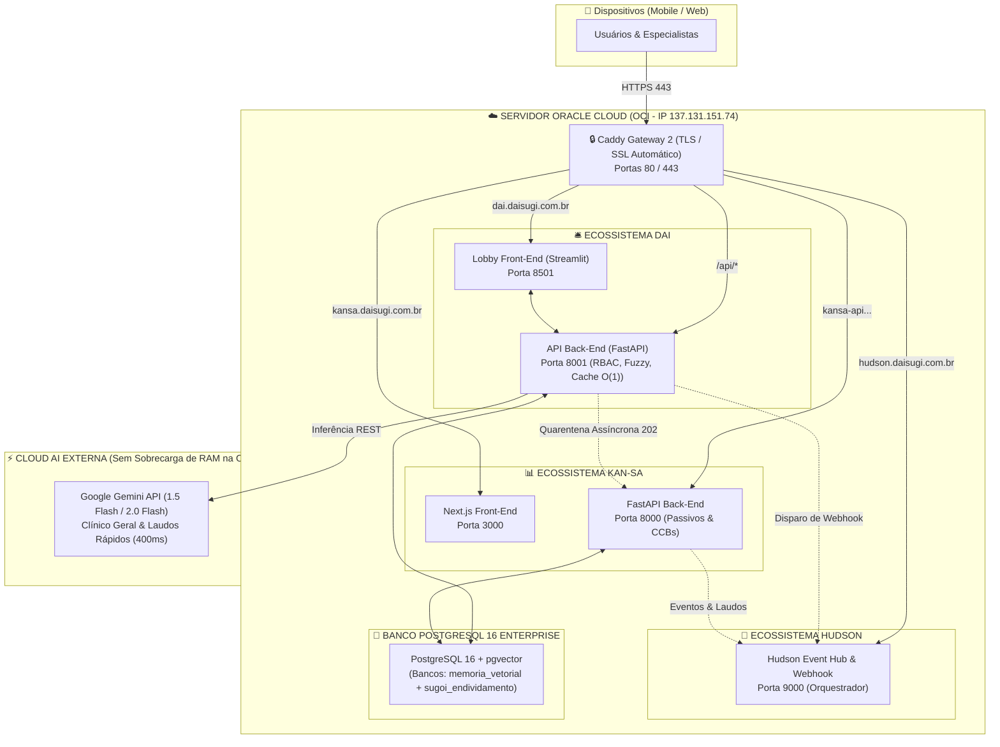

# ☁️ Arquitetura de Infraestrutura em Nuvem: Servidor Oracle Cloud (OCI) & Ecossistema DAISUGI

**Autor:** Equipe de Engenharia e Infraestrutura Cloud DAISUGI  
**Servidor Alvo:** Oracle Cloud Infrastructure (OCI) - IP `137.131.151.74`  
**Região:** `sa-saopaulo-1` (São Paulo, Brasil)  
**Domínio Raiz:** `daisugi.com.br`  

---

## 1. Diagnóstico Pericial: O Que Foi Feito no `02_Daisugi_kan-sa`

Ao analisar minuciosamente o repositório `02_Daisugi_kan-sa` (em especial os documentos de arquitetura, scripts de implantação e o `docker-compose.yml`), identificamos a seguinte configuração traçada para a máquina de produção:

*   **Instância Provisionada:** `daisugi-core-prod` (`137.131.151.74`).
*   **Sistema Operacional:** Ubuntu 24.04 Minimal LTS.
*   **Shape de Hardware:** `VM.Standard.E2.1.Micro` (1 OCPU AMD, **1 GB de memória RAM**, 50 GB Boot Volume) sob o plano *Always Free*.
*   **Containers Projetados no Docker Compose:**
    1.  `postgres:16-alpine` (Banco relacional contábil/pericial).
    2.  `backend` (FastAPI em Python 3.12/3.14 com Uvicorn).
    3.  `frontend` (Next.js 14 SSR com Node.js).
    4.  `daisugi-ai` (Serviço de IA com Docling e LangChain na porta 5000).
    5.  `caddy` (Proxy reverso para roteamento e certificados TLS automáticos).

---

## 2. Causa Raiz: Por Que o Back-End do Kan-sa Falhou no Servidor Oracle?

A causa dos problemas no back-end e no deploy do Kan-sa na Oracle foi uma combinação de **três fatores críticos de infraestrutura**:

### 2.1. O Gargalo Fatal de Memória RAM (OOM Killer do Linux)
*   A máquina possui apenas **1.024 MB (1 GB) de memória RAM**.
*   **Consumo Real da Stack Projetada:**
    *   *Kernel do Ubuntu:* ~150 MB.
    *   *PostgreSQL 16:* ~150 MB a 250 MB.
    *   *FastAPI Backend (Python + libs):* ~200 MB a 350 MB.
    *   *Next.js 14 Frontend:* ~400 MB a 800 MB (podendo ultrapassar 1,5 GB durante o comando `npm run build`).
    *   *Docling Hub (PyTorch/OCR):* Requer no mínimo **4 GB a 8 GB de RAM** para carregar pesos neurais.
*   **O que aconteceu:** Ao executar `docker compose up --build`, a memória física esgotou-se em segundos. O kernel do Linux disparou o **OOM-Killer (Out of Memory Killer)**, matando silenciosamente o processo do Uvicorn ou do PostgreSQL, ou travando a conexão SSH da máquina por completo. Como o Ubuntu da Oracle não vem com memória Swap configurada por padrão, qualquer pico acima de 1 GB derruba o sistema.

### 2.2. Variável de Ambiente do Frontend com `localhost`
No arquivo `docker-compose.yml` do Kan-sa:
```yaml
environment:
  - NEXT_PUBLIC_API_URL=http://localhost:8000/api/v1
```
*   Variáveis que começam com `NEXT_PUBLIC_` são embutidas no código JavaScript que roda no **navegador do usuário** (client-side).
*   Quando um usuário externo tentava usar o sistema pelo navegador, o front tentava chamar `http://localhost:8000`, que apontava para a própria máquina do cliente em vez do IP ou domínio da Oracle (`137.131.151.74`), gerando erro de `Connection Refused` ou `Failed to fetch`.

### 2.3. Firewall Duplo da Oracle (Security List + iptables)
*   A OCI possui firewall na camada de rede virtual (Security List na VCN).
*   Além disso, as imagens oficiais do Ubuntu na Oracle vêm com regras internas de `iptables` ativas que **bloqueiam portas de entrada** mesmo que a Security List esteja aberta. É necessário sincronizar as portas ou descarregar o tráfego no Caddy nas portas 80 e 443.

---

## 3. A Estratégia de Ouro: Como Destravar a Nuvem Oracle

Existem dois caminhos práticos para resolver isso de forma definitiva:

### 🏆 OPÇÃO A (Recomendação Máxima): A Mina de Ouro do Always Free (Ampere A1 Flex)
A Oracle Cloud possui o plano gratuito mais generoso do mundo para instâncias **ARM Ampere A1 (`VM.Standard.A1.Flex`)**:
*   **Recursos 100% Gratuitos e Perpétuos:**
    *   **Até 4 OCPUs (núcleos de processador)**.
    *   **Até 24 GB de memória RAM**.
    *   **Até 200 GB de armazenamento NVMe em bloco**.
*   **Impacto no Ecossistema:**
    Se você criar uma instância com esse shape (ou redimensionar), seus 1 GB de RAM saltam para **24 GB de RAM**. 
    Nessa máquina de 24 GB rodam com folga total:
    *   ✅ O banco PostgreSQL 16 com `pgvector`.
    *   ✅ O Redis Cache em memória.
    *   ✅ O backend do Kan-sa (FastAPI).
    *   ✅ O frontend do Kan-sa (Next.js).
    *   ✅ O backend da Dai (FastAPI).
    *   ✅ O frontend da Dai (Streamlit ou PWA).
    *   ✅ O motor de IA (Docling / embeddings locais).
    *   ✅ O proxy reverso Caddy com SSL.

### 🛠️ OPÇÃO B: Hardening Extremo da VM Atual de 1 GB (E2.1.Micro)
Se você optar por manter a instância atual de 1 GB sem recriá-la, precisamos aplicar as seguintes regras de sobrevivência:
1.  **Criar Swap de 4 GB** no disco da máquina para o Linux ter margem de alocação:
    ```bash
    sudo fallocate -l 4G /swapfile
    sudo chmod 600 /swapfile
    sudo mkswap /swapfile
    sudo swapon /swapfile
    echo '/swapfile none swap sw 0 0' | sudo tee -a /etc/fstab
    ```
2.  **Não rodar IA pesada localmente:** Em vez de subir Ollama e Docling na VM, conectar via API externa (Gemini API para embeddings com `text-embedding-004` e inferência).
3.  **Não compilar o Next.js dentro do servidor:** Fazer o build na máquina local ou GitHub Actions e enviar apenas os arquivos estáticos ou imagem Docker pronta para a Oracle.
4.  **Limitar a memória de cada container no Compose:** Definir `mem_limit: 256m` para evitar que um container derrube os outros.

---

## 4. Topologia de Ancoragem da DAI e KAN-SA no Servidor

Para que o sistema **não dependa da sua máquina física** e rode 24 horas por dia, 7 dias por semana com alta segurança e agilidade:



---

## 5. Roteamento de Subdomínios e Configuração Caddy (`Caddyfile`)

O servidor Caddy gerencia os certificados SSL Let's Encrypt automaticamente para todos os subdomínios:

```caddyfile
# -------------------------------------------------------------
# 1. KAN-SA: Auditoria, Passivos e Governança
# -------------------------------------------------------------
kansa.daisugi.com.br {
    reverse_proxy localhost:3000

    handle /api/v1/* {
        reverse_proxy localhost:8000
    }
}

# -------------------------------------------------------------
# 2. DAI: Recepção Inteligente, Triagem e Lobby
# -------------------------------------------------------------
dai.daisugi.com.br {
    reverse_proxy localhost:8501

    handle /api/* {
        reverse_proxy localhost:8001
    }
}

# -------------------------------------------------------------
# 3. HUDSON: Orquestrador & Webhook Central
# -------------------------------------------------------------
hudson.daisugi.com.br {
    reverse_proxy localhost:9000
}

# -------------------------------------------------------------
# 4. TRONCO-MÃE: Plataforma Geral DAISUGI
# -------------------------------------------------------------
daisugi.com.br {
    root * /var/www/daisugi
    file_server
}
```

---

## 6. Procedimento Passo a Passo para Subir a DAI no Servidor Oracle

### Passo 1: Acessar a Instância via SSH
```bash
ssh -i sua-chave-oracle.key ubuntu@137.131.151.74
```

### Passo 2: Liberar o Firewall Interno do Ubuntu para o Caddy
```bash
sudo iptables -I INPUT 6 -m state --state NEW -p tcp --dport 80 -j ACCEPT
sudo iptables -I INPUT 6 -m state --state NEW -p tcp --dport 443 -j ACCEPT
sudo netfilter-persistent save
```

### Passo 3: Clonar o Repositório da Dai no Servidor
```bash
cd /opt
sudo git clone https://github.com/MV-AKAGUI/Dai_Smart_Reception_Framework.git
cd Dai_Smart_Reception_Framework
```

### Passo 4: Criar o Arquivo de Variáveis de Produção (`.env`)
```bash
sudo cp .env.example .env
sudo nano .env
```
*(Preencher com as credenciais seguras de banco e JWT)*

### Passo 5: Inicializar os Serviços via Docker
```bash
sudo docker compose up -d --build
```

### Passo 6: Verificar Status e Logs
```bash
sudo docker compose ps
sudo docker compose logs -f api_backend
```

---

## 7. Configuração do Ambiente de Produção (Instalação do Docker e Caddy)

Para provisionar novas instâncias OCI ou documentar o ambiente do zero:

### 7.1 Instalação do Docker Engine e Docker Compose Plugin (Ubuntu 24.04 LTS)
```bash
# Atualizar repositórios e instalar pré-requisitos
sudo apt update && sudo apt install -y ca-certificates curl gnupg lsb-release

# Adicionar chave GPG oficial do Docker
sudo install -m 0755 -d /etc/apt/keyrings
sudo curl -fsSL https://download.docker.com/linux/ubuntu/gpg -o /etc/apt/keyrings/docker.asc
sudo chmod a+r /etc/apt/keyrings/docker.asc

# Configurar o repositório estável
echo "deb [arch=$(dpkg --print-architecture) signed-by=/etc/apt/keyrings/docker.asc] https://download.docker.com/linux/ubuntu $(lsb_release -cs) stable" | sudo tee /etc/apt/sources.list.d/docker.list > /dev/null

# Instalar Docker Engine, CLI, Containerd e Docker Compose
sudo apt update
sudo apt install -y docker-ce docker-ce-cli containerd.io docker-buildx-plugin docker-compose-plugin

# Permitir execução sem sudo (opcional) e habilitar no boot
sudo usermod -aG docker ubuntu
sudo systemctl enable docker
sudo systemctl start docker
```

### 7.2 Instalação e Arquitetura do Caddy Gateway
O Caddy é operado através de um container Docker isolado em `/opt/daisugi/docker-compose.yml` utilizando `network_mode: host`:
```yaml
services:
  daisugi-gateway:
    image: caddy:2-alpine
    container_name: daisugi-gateway
    restart: always
    network_mode: host
    volumes:
      - ./Caddyfile:/etc/caddy/Caddyfile
      - caddy_data:/data
      - caddy_config:/config
volumes:
  caddy_data:
  caddy_config:
```
Para recarregar alterações de rotas sem derrubar o tráfego:
```bash
sudo docker exec daisugi-gateway caddy reload --config /etc/caddy/Caddyfile
```

---

## 8. Blindagem de Segurança do Servidor (Firewall, Isolamento e Autenticação)

### 8.1 Regras de Ingress na OCI VCN (Security Lists)
No console da Oracle Cloud Infrastructure (`Networking` > `Virtual Cloud Networks` > `Security Lists`):
- **Porta 22 (SSH)**: Permitir apenas com chave SSH (Desabilitar `PasswordAuthentication` em `/etc/ssh/sshd_config`).
- **Portas 80 (HTTP) e 443 (HTTPS)**: Liberadas publicamente `0.0.0.0/0` para o Caddy Gateway.
- **Portas 5432 (Postgres), 8000/8001 (APIs), 8501 (Streamlit)**: **BLOQUEADAS** na Security List externa. Apenas o Caddy local e a rede Docker interna podem se comunicar com essas portas.

### 8.2 Configuração de Firewall Interno no Host (`iptables` / `netfilter-persistent`)
O Ubuntu na OCI vem com regras restritivas pré-definidas em `iptables`. As portas 80 e 443 devem ser inseridas antes da regra de drop:
```bash
# Liberar HTTP e HTTPS
sudo iptables -I INPUT 6 -m state --state NEW -p tcp --dport 80 -j ACCEPT
sudo iptables -I INPUT 6 -m state --state NEW -p tcp --dport 443 -j ACCEPT

# Persistir as regras após reinicializações
sudo apt install -y iptables-persistent netfilter-persistent
sudo netfilter-persistent save
```

### 8.3 Isolamento de Rede Docker
No arquivo `docker-compose.yml`, as portas do banco e dos microserviços podem ser vinculadas exclusivamente à interface de loopback (`127.0.0.1:8001:8001` e `127.0.0.1:8501:8501`), impedindo que varreduras externas acessem os serviços sem passar pelo TLS do Caddy.

### 8.4 Autenticação em Camadas (Defense in Depth)
1. **Frontend / Lobby**: Autenticação via formulário com geração de Token JWT de sessão assinado.
2. **API Backend**: Middleware RBAC com validação estrita de Bearer Token em endpoints administrativos (`/api/quarentena/validar`), bloqueando escalada de privilégios com HTTP 403.
3. **Comunicação Inter-serviços**: Segredos de integração (ex: tokens de webhook) injetados via variáveis de ambiente seguras no arquivo `.env`.

---

## 9. Manutenção Contínua, Rotina de Backup e Atualizações Zero-Downtime

### 9.1 Rotina de Backup Automatizado do pgvector (Memória da Dai)
Para garantir que as sinapses vetoriais e tabelas multi-tenant não sejam perdidas, configure um cronjob diário:
```bash
# Criar diretório de backups
sudo mkdir -p /opt/daisugi/backups

# Script de backup (/opt/daisugi/backup_pgvector.sh)
cat << 'EOF' | sudo tee /opt/daisugi/backup_pgvector.sh
#!/bin/bash
TIMESTAMP=$(date +"%Y%m%d_%H%M%S")
BACKUP_DIR="/opt/daisugi/backups"
sudo docker exec dai_postgres_vector pg_dump -U admin memoria_vetorial | gzip > "$BACKUP_DIR/dai_memoria_$TIMESTAMP.sql.gz"
# Reter apenas os últimos 15 dias de backup
find "$BACKUP_DIR" -name "dai_memoria_*.sql.gz" -mtime +15 -delete
EOF

sudo chmod +x /opt/daisugi/backup_pgvector.sh

# Adicionar ao crontab para rodar às 03:00 da manhã
(crontab -l 2>/dev/null; echo "0 3 * * * /opt/daisugi/backup_pgvector.sh") | crontab -
```

### 9.2 Procedimento de Atualização Zero-Downtime
Quando houver novas versões no GitHub:
```bash
cd /opt/daisugi/dai
# 1. Puxar alterações do repositório
sudo git pull origin main

# 2. Reconstruir a imagem e recriar os containers sem derrubar o banco
sudo docker compose up -d --build --no-deps dai_backend dai_lobby

# 3. Limpar imagens antigas para economizar espaço em disco
sudo docker image prune -f
```

### 9.3 Monitoramento de Saúde e Telemetria
- **Verificar consumo de RAM e Swap**: `free -h`
- **Verificar uso de CPU e memória por container**: `sudo docker stats --no-stream`
- **Healthcheck do Backend da Dai**: `curl -f http://localhost:8001/health`
- **Verificar logs em tempo real**: `sudo docker compose logs -f --tail=100 dai_backend`

