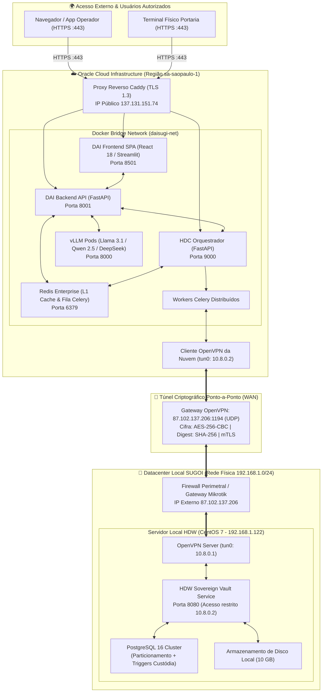

# 🌐 Infraestrutura, Topologia de Rede & Matriz de APIs

**Ecossistema:** Daisugi Tecnologias  
**Documento:** `INFRAESTRUTURA_TOPOLOGIA_OPENVPN_E_MATRIZ_APIS.md`  
**Público-Alvo:** Engenheiros de Infraestrutura Cloud (OCI), Administradores de Redes & Firewalls, Engenheiros DevOps e Especialistas em Cibersegurança.  
**Versão:** `v2.0.0`  
**Data:** Outubro de 2026  
**Status:** 🚀 **HOMOLOGADO PARA PRODUÇÃO & TELEMETRIA**

---

## 1. Topologia Integrada: Nuvem OCI × Datacenter Local SUGOI

A infraestrutura é estruturada em modelo **Híbrido Soberano**, combinando o poder computacional elástico da Oracle Cloud Infrastructure com o armazenamento físico soberano na sede da SUGOI.



---

## 2. Especificação Técnica da Conexão OpenVPN

### 2.1. Parâmetros Criptográficos e de Transporte
- **Endereço do Gateway:** `87.102.137.206:1194`
- **Protocolo de Camada 4:** `UDP` (otimizado para streaming contínuo e menor latência de retransmissão).
- **Dispositivo Virtual:** `tun0` (camada IP routed).
- **Cifra Simétrica de Dados:** `AES-256-CBC` (chave de 256 bits).
- **Algoritmo de Digest/Integridade:** `SHA-256`.
- **Mecanismo de Autenticação:** **mTLS (Autenticação Mútua por Certificados)** com chaves de 4096 bits (RSA) e proteção adicional via `tls-auth` (chave estática HMAC contra scanning e DoS).
- **Sub-rede VPN:** `10.8.0.0/24`
  - IP do Servidor HDW (CentOS 7): `10.8.0.1`
  - IP do Cliente OCI (HDC): `10.8.0.2`

### 2.2. Trecho de Configuração do Cliente OCI (`/etc/openvpn/client/hdc-hdw.conf`)
```ini
client
dev tun
proto udp
remote 87.102.137.206 1194
resolv-retry infinite
nobind
persist-key
persist-tun
ca /etc/openvpn/certs/ca.crt
cert /etc/openvpn/certs/hdc-oci.crt
key /etc/openvpn/certs/hdc-oci.key
tls-auth /etc/openvpn/certs/ta.key 1
cipher AES-256-CBC
auth SHA256
keepalive 10 60
verb 3
mute 20
```

---

## 3. Matriz Completa de APIs do Ecossistema

| Domínio | Método | Endpoint / Rota | Origem ➜ Destino | Autenticação / Headers | Descrição e Ação Principal |
| :--- | :---: | :--- | :---: | :--- | :--- |
| **Triagem & Chat** | `POST` | `/api/v1/chat/completions/stream` | SPA ➜ DAI Backend | `Bearer <JWT_USUARIO>` | Streaming de tokens (SSE) com LLM Open Source (Llama 3.1 / Qwen / DeepSeek). |
| **Árvore WBS** | `GET` | `/api/v1/wbs/tree` | SPA ➜ DAI Backend | `Bearer <JWT_USUARIO>` | Obtém nós hierárquicos filtrados por permissão do cofre PAM. |
| **Estantes** | `GET` | `/api/v1/estantes/{id}/itens` | SPA ➜ DAI Backend | `Bearer <JWT_USUARIO>` | Listagem paginada de documentos com cota determinística e hash SHA-256. |
| **Orquestração** | `POST` | `/api/v1/tarefas` | DAI ➜ HDC Gateway | `X-Daisugi-Signature`<br/>`X-Idempotency-Key` | Padrão Fire-and-Enqueue (HTTP 202 em < 150 ms) para processamento Celery. |
| **Status Tarefa** | `GET` | `/api/v1/tarefas/{task_id}` | DAI ➜ HDC Gateway | `Bearer <JWT_SISTEMA>` | Consulta do estado de execução do Celery Worker no Redis. |
| **Custódia Local** | `POST` | `/api/v1/custodia/gravar` | HDC ➜ HDW Local | `X-API-Key`<br/>*(Rede 10.8.0.0/24)* | Envio de arquivo em streaming (1 MiB), cálculo de hash e gravação no CentOS 7. |
| **Perícia Forense**| `POST` | `/api/v1/forensics/authenticity`| SPA ➜ HDC ➜ HDW | `Bearer <JWT_PERITO>`<br/>`X-API-Key` | Recalcula hash físico em disco e confronta com o log histórico da partição anual. |
| **Webhooks** | `POST` | `/api/v1/eventos/callback` | HDC ➜ DAI Backend | `X-Daisugi-Signature` | Notifica conclusão de laudos periciais ou alertas de divergência. |

---

## 4. Políticas de Resiliência & Circuit Breaker

### 4.1. Retenção de Cargas por até 72 Horas no Redis
Se o link de internet da sede da SUGOI (`87.102.137.206`) oscilar ou cair:
1. **Ativação do Circuit Breaker:** Ao detectar 3 timeouts consecutivos de 5 segundos, o HDC abre o circuito para o HDW.
2. **Buffer Local de Retenção:** As tarefas de gravação de evidências e auditorias são retidas nas filas do Redis (`AOF - Append Only File` ativado para persistência em disco na nuvem).
3. **Janela de Resiliência:** O cluster OCI retém com segurança até **72 horas de tarefas pendentes**.
4. **Auto-Reconexão:** Assim que a VPN restabelecer a conexão (handshake TLS concluído), o Celery drena a fila de forma cadenciada sem sobrecarregar a CPU do CentOS 7.

---

## 5. Plano de Disaster Recovery (RPO = 0 / RTO < 1h)

### 5.1. Estratégia de Backup Físico e Lógico
1. **Backups Binários Diários Particionados:**
   - Rotina automatizada executando `pg_dump -Fc` particionado por ano (`custody_log_2025`, `custody_log_2026`, etc.).
   - Geração de dump consistente com trava de integridade.
2. **Espelhamento Externo Criptografado com Object Lock:**
   - Os arquivos de dump e volumes de custódia são espelhados em Bucket OCI Object Storage configurado com **WORM (Write Once, Read Many / Object Lock)**.
   - Retenção legal bloqueada contra exclusão por 5 anos (atendimento pleno a normas periciais e fiscais).
3. **Métricas de Recuperação:**
   - **RPO (Recovery Point Objective):** `0` (Perda zero de transações validadas devido aos logs WAL síncronos).
   - **RTO (Recovery Time Objective):** `< 1 hora` para restauração total do ambiente em nova máquina virtual.
