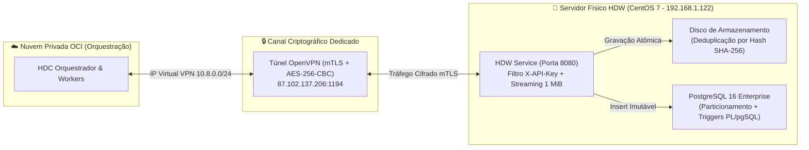

# 🏛️ Especificação de Custódia Forense Soberana: HDC × HDW

**Ecossistema:** Daisugi Tecnologias  
**Documento:** `INTEGRACAO_HDC_HDW_CUSTODIA_FORENSE_SOBERANA.md`  
**Público-Alvo:** Dr. Taylor, Administradores de Banco de Dados (DBA PostgreSQL), Especialistas em Computação Forense e Compliance Jurídico.  
**Versão:** `v2.0.0`  
**Data:** Outubro de 2026  
**Status:** 🚀 **HOMOLOGADO PARA CUSTÓDIA JURÍDICA E PERICIAL**

---

## 1. Princípios da Custódia Forense Soberana

A custódia probatória da SUGOI / Daisugi repousa no conceito de **Soberania Computacional de Dados Sensíveis**:
- Os arquivos físicos originais (plantas, contratos, laudos e e-mails) **permanecem estritamente sob guarda física** no datacenter local da SUGOI (`192.168.1.122`), em servidor Linux CentOS 7.
- A nuvem OCI (onde operam a DAI e o HDC) possui acesso unicamente através de canal seguro criptografado com privilégios mínimos.
- O sistema garante **Auditabilidade Contínua**, **Não-Repúdio Criptográfico** e **Imutabilidade Estrita de Registros Históricos**.



---

## 2. Tunelamento Seguro & Autenticação Mútua

1. **Restrição Estrita de Origem:** O firewall iptables do CentOS 7 no HDW local rejeita sumariamente qualquer pacote na porta `8080` que não provenha da sub-rede do túnel OpenVPN (`10.8.0.x`).
2. **Dupla Barreira de Autenticação:**
   - **Camada de Rede (L4):** Autenticação mútua TLS (mTLS) com certificados X.509 assinados pela autoridade certificadora interna Daisugi.
   - **Camada de Aplicação (L7):** Cabeçalho `X-API-Key` rotacionado dinamicamente via cofre PAM corporativo.

---

## 3. Cadeia de Custódia Imutável & Hash Streaming (1 MiB)

### 3.1. Cálculo de Hash SHA-256 em Streaming
Para acomodar arquivos de grande porte (plantas de engenharia de 80 MB ou laudos escaneados em alta resolução) sem estourar os recursos de memória RAM do servidor CentOS 7, o cálculo do hash nunca carrega o arquivo completo na memória:

```python
# hdw/crypto/stream_hasher.py
import hashlib
import os

CHUNK_SIZE = 1024 * 1024  # Bloco de 1 MiB

async def calcular_hash_streaming_e_salvar(file_stream, destination_path: str) -> dict:
    sha256_hasher = hashlib.sha256()
    tamanho_total = 0
    
    with open(destination_path, "wb") as buffer:
        while True:
            chunk = await file_stream.read(CHUNK_SIZE)
            if not chunk:
                break
            sha256_hasher.update(chunk)
            buffer.write(chunk)
            tamanho_total += len(chunk)
            
    hash_final = sha256_hasher.hexdigest()
    return {
        "hash_sha256": hash_final,
        "bytes_totais": tamanho_total
    }
```

### 3.2. Deduplicação Física no Disco
Se um arquivo com o mesmo hash SHA-256 já existir no disco físico:
1. O novo arquivo em trânsito não duplica o consumo de armazenamento.
2. É criado um ponteiro referencial seguro no banco de dados.
3. Isso preserva a capacidade do disco rígido local do servidor CentOS 7.

### 3.3. Cota Determinística
A cota probatória de identificação única segue o padrão canônico:
`[ESTANTE]-[WBS]-[ANO]-[HASH8]`

*Exemplo:* `EST01-WBS014-2026-A4F79C12`
- `EST01`: Estante Projetos & As-Built.
- `WBS014`: Empreendimento Reserva dos Ipês (WBS 14).
- `2026`: Ano de custódia e partição física no banco.
- `A4F79C12`: 8 primeiros caracteres hexadecimais do hash SHA-256 da evidência.

---

## 4. Gatilhos em PL/pgSQL: Imutabilidade Absoluta da Custódia

Para impedir qualquer possibilidade de adulteração (inclusive por operadores com privilégio de `postgres` ou `dba`), o banco implementa gatilhos bloqueantes (*hard security triggers*):

### 4.1. Esquema Particionado e Triggers de Bloqueio

```sql
-- DDL da Tabela de Custódia Particionada por Ano
CREATE TABLE custody_log (
    id BIGSERIAL,
    cota_documento VARCHAR(64) NOT NULL,
    hash_sha256 CHAR(64) NOT NULL,
    item_id UUID NOT NULL,
    data_custodia TIMESTAMP WITH TIME ZONE DEFAULT CURRENT_TIMESTAMP NOT NULL,
    ano_custodia INT NOT NULL,
    operador_responsavel VARCHAR(120) NOT NULL,
    metadados JSONB,
    PRIMARY KEY (id, ano_custodia)
) PARTITION BY RANGE (ano_custodia);

-- Criação das Partições Oficiais
CREATE TABLE custody_log_2025 PARTITION OF custody_log
    FOR VALUES FROM (2025) TO (2026);

CREATE TABLE custody_log_2026 PARTITION OF custody_log
    FOR VALUES FROM (2026) TO (2027);

CREATE TABLE custody_log_2027 PARTITION OF custody_log
    FOR VALUES FROM (2027) TO (2028);

-- 🔒 Gatilho 1: Bloqueio Total de UPDATE e DELETE no custody_log
CREATE OR REPLACE FUNCTION trg_prevent_tampering_custody()
RETURNS TRIGGER AS $$
BEGIN
    RAISE EXCEPTION 'VIOLACAO_FORENSE: Registros na tabela custody_log sao imutaveis. Proibido UPDATE ou DELETE (Operacao: % por Usuario: %)', 
        TG_OP, CURRENT_USER;
    RETURN NULL;
END;
$$ LANGUAGE plpgsql;

CREATE TRIGGER trg_custody_no_update_delete
BEFORE UPDATE OR DELETE ON custody_log
FOR EACH ROW EXECUTE FUNCTION trg_prevent_tampering_custody();

-- 🔒 Gatilho 2: Bloqueio de DELETE na tabela de Itens Principais (Permitido apenas Soft-Delete/Arquivamento)
CREATE OR REPLACE FUNCTION trg_prevent_delete_items()
RETURNS TRIGGER AS $$
BEGIN
    RAISE EXCEPTION 'VIOLACAO_FORENSE: Itens custodiados nao podem ser deletados fisicamente do banco de dados.';
    RETURN NULL;
END;
$$ LANGUAGE plpgsql;

CREATE TRIGGER trg_items_no_delete
BEFORE DELETE ON items
FOR EACH ROW EXECUTE FUNCTION trg_prevent_delete_items();
```

---

## 5. Rota de Perícia Forense (`/authenticity`)

A rota `/authenticity` é o mecanismo central acionado pelo Dr. Taylor ou pela auditoria jurídica para verificar se uma evidência arquivada sofreu qualquer corrupção por degradação física (*bit rot*) ou intervenção humana não autorizada.

### 5.1. Fluxo de Execução da Rota:
1. Recebe parâmetros: `cota_documento` e `hash_esperado`.
2. O HDW localiza o arquivo binário em disco.
3. Executa leitura streaming recalculando o hash SHA-256 do arquivo real em blocos de 1 MiB.
4. Consulta a partição anual correspondente em `custody_log`.
5. Se `Hash_Recalculado == Hash_Gravado == Hash_Esperado`:
   - Emite atestado pericial com status `CONFIRMADO_100_AUTENTICO`.
6. Se divergente:
   - Emite imediatamente evento crítico `ALERTA_ADULTERACAO_FORENSE` com isolamento do nó.

---

## 6. Preservação de Recursos Locais (Hardware CentOS 7)

Devido às restrições operacionais do servidor local (armazenamento estrito de 10 GB utilizável e memória reduzida):
1. **Sem Processamento de LLM Local:** Nenhuma inferência neural roda no CentOS 7. Toda carga de inteligência artificial é absorvida pelo cluster OCI.
2. **Buffer Máximo em Memória:** Limitado a 8 MB por conexão concorrente via `Uvicorn` e `Nginx`.
3. **Expurgo Automático de Temporários:** Arquivos temporários de upload não confirmados são purgados a cada 60 minutos via cron job com retenção zero.
