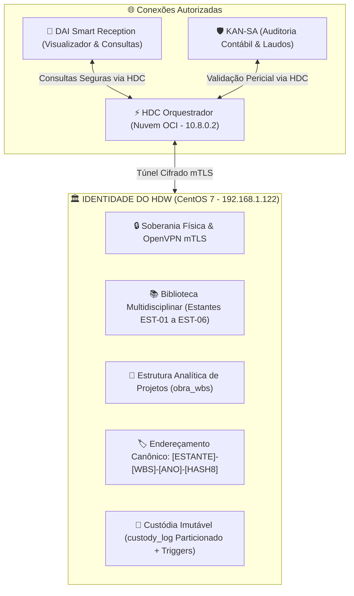
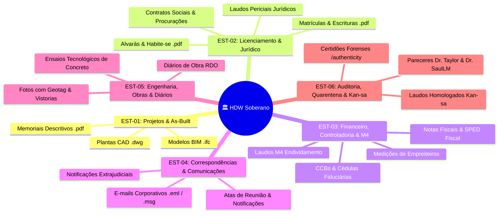
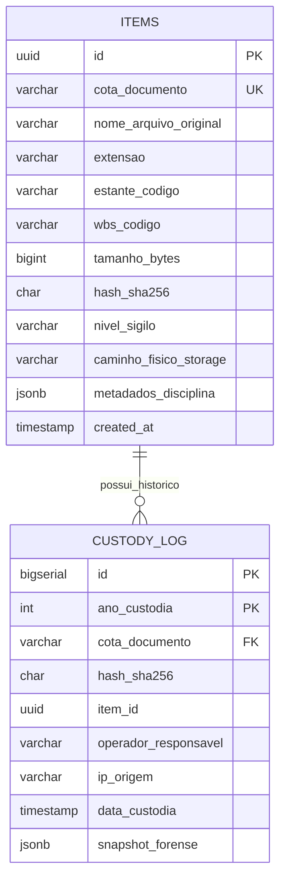

# 🏛️ Diretriz de Parametrização, Taxonomia & Identidade do HDW
**Documento:** `PARAMETRIZACAO_TAXONOMIA_E_IDENTIDADE_HDW.md`  
**Autor:** Dr. Taylor Code (Arquiteto Forense Chefe) & Colegiado de Especialistas (Dr. SaulLM, Qwen 2.5, Mistral-Nemo)  
**Supervisão:** Diretoria de PMO de TI, Governança, Processos e Engenharia  
**Classificação:** Norma Canônica de Governança de Dados, Custódia Probatória & Arquitetura de DW  
**Versão:** `v2.0.0` (Soberania Linux CentOS 7 × HDC OCI)  
**Data:** Outubro de 2026  
**Status:** 🚀 **HOMOLOGADO PARA PRODUÇÃO E COMPLIANCE JURÍDICO**

---

## 1. Manifesto de Identidade & Missão do HDW

O **Hudson Data Warehouse (HDW)** não é um repositório genérico de arquivos nem um banco de dados relacional comum. Ele é o **Cofre Soberano de Evidências, Ativos Digitais e Custódia Fiduciária da SUGOI Construtora e do Ecossistema DAISUGI**.

### Princípios Inegociáveis da Identidade HDW:
1. **Soberania Física Inviolável:** O HDW reside em hardware próprio (`192.168.1.122` - CentOS 7), protegido por isolamento de rede e acessível externamente **única e exclusivamente pelo HDC da nuvem OCI através de túnel criptografado OpenVPN (mTLS)**.
2. **Biblioteca Multidisciplinar Universal:** O HDW custodia desde laudos contábeis e contratos de financiamento imobiliário (CCBs/CRIs) até plantas técnicas de engenharia (`.dwg`), modelos paramétricos BIM (`.ifc`), correspondências corporativas (`.eml`/`.msg`) e registros diários de obra (RDOs).
3. **Não-Repúdio e Determinismo Criptográfico:** Nenhuma evidência entra no HDW sem cálculo streaming de hash SHA-256 e geração de cota imutável. Um arquivo corrompido em 1 único bit é imediatamente denunciado na rota `/authenticity`.
4. **Imutabilidade Absoluta:** O banco de dados PostgreSQL bloqueia por gatilhos intransponíveis em nível de kernel (`PL/pgSQL`) qualquer tentativa de exclusão (`DELETE`) ou adulteração (`UPDATE`) nos livros de custódia.
5. **Eficiência de Recursos:** Projetado para operar com estabilidade máxima em disco enxuto (10 GB) e consumo restrito de memória RAM através de deduplicação física por hash e processamento em streaming (1 MiB).



---

## 2. A Biblioteca Multidisciplinar: As 6 Estantes Canônicas do HDW

A organização de assuntos no HDW adota o conceito de **Estantes Virtuais Parametrizadas**, onde cada documento pertence a uma estante temática com regras estritas de extensão, visualização e tempo de guarda.



### Matriz Detalhada de Parametrização por Estante:

| Código | Nome da Estante | Disciplina / Finalidade | Extensões Homologadas | Visualizador na DAI | Nível de Sigilo Padrão |
| :---: | :--- | :--- | :---: | :--- | :---: |
| **`EST-01`** | **Projetos & As-Built** | Engenharia, Arquitetura, Estrutura, Instalações Elétricas e Hidráulicas. | `.dwg`, `.dxf`, `.ifc`, `.pdf` | WebGL CAD Viewer / Web-IFC 3D / PDF TextLayer | `INTERNO` |
| **`EST-02`** | **Licenciamento & Jurídico** | Alvarás, Habite-se, Matrículas Cartorárias, Contratos Sociais, Laudos. | `.pdf`, `.p7s` (Assinatura ICP-Brasil) | Leitor PDF com Validador de Assinatura Digital | `RESTRITO` |
| **`EST-03`** | **Financeiro & M4** | Controle de Dívidas (M4), CCBs, Contratos Bancários, Borderôs, SPED, NFs. | `.pdf`, `.xlsx`, `.xml` (NFe), `.csv` | Planilha Dinâmica / Viewer M4 com Conciliação Zero | `CONFIDENCIAL_PAM` |
| **`EST-04`** | **Correspondências** | Notificações extrajudiciais, atas societárias e e-mails de negociação. | `.eml`, `.msg`, `.pdf` | Renderizador HTML com Sanitização DOMPurify | `RESTRITO` |
| **`EST-05`** | **Diários & Ensaios** | RDOs digitalizados, controle tecnológico de concreto e fotos periciais. | `.pdf`, `.jpg`, `.png`, `.heic` | Overlay OCR Amarelo / Galeria com Metadados EXIF | `INTERNO` |
| **`EST-06`** | **Auditoria & Kan-sa** | Laudos oficiais de auditoria, histórico de quarentena e certidões probatórias. | `.pdf`, `.json` (Lastro Criptográfico) | Modal de Certidão Forense com QR Code e Hash | `CONFIDENCIAL_PAM` |

---

## 3. Hierarquia WBS (*Work Breakdown Structure*) & Empreendimentos

O segundo eixo ordenador do HDW é a **Árvore WBS**. Nenhum documento é solto na raiz; ele obrigatoriamente vincula-se a uma unidade da estrutura analítica de projetos.

### Níveis da Árvore WBS:
- **Nível 1 (Empreendimento / SPE):** Identificador mestre do ativo imobiliário ou corporativo.  
  *Exemplos:* `WBS-SUG-014` (Reserva dos Ipês), `WBS-SUG-022` (Parque das Flores), `WBS-CORP-001` (Holding SUGOI S.A.).
- **Nível 2 (Fase / Bloco / Torre):** Segmentação física da obra.  
  *Exemplos:* `T1` (Torre A), `T2` (Torre B), `GAR` (Edifício Garagem), `ADM` (Sede Administrativa).
- **Nível 3 (Pavimento / Localização Espacial):** Localização pontual do elemento.  
  *Exemplos:* `SUB` (Subsolo Técnico), `TER` (Térreo/Áreas Comuns), `P01` a `P20` (Pavimentos Tipo), `COB` (Cobertura/Barrilete).
- **Nível 4 (Pacote / Disciplina de Trabalho):**  
  *Exemplos:* `EST` (Estrutura de Concreto), `ELE` (Instalações Elétricas), `HID` (Hidráulica e Incêndio), `FIN` (Acabamentos e Fachada).

---

## 4. Cota Determinística & Padrão de Armazenamento Físico no Linux

### 4.1. Fórmula Matemática da Cota Canônica
A cota do HDW é a "identidade de nascimento" do arquivo e é imutável:
$$\text{COTA} = \mathbf{[ESTANTE] - [WBS] - [ANO] - [HASH8]}$$

*Exemplo:* `EST01-WBS014-2026-F4B27A9C`
- `EST01`: Estante Projetos & As-Built.
- `WBS014`: Empreendimento Reserva dos Ipês.
- `2026`: Ano de custódia fiduciária.
- `F4B27A9C`: 8 primeiros dígitos hexadecimais do hash SHA-256 do binário.

### 4.2. Estrutura Física de Diretórios no CentOS 7 (`/opt/hdw/storage/`)
Para compatibilizar a taxonomia com o sistema de arquivos do Linux e garantir que **mesmo se o banco de dados caísse, um perito conseguiria navegar na árvore física**:

```bash
/opt/hdw/storage/
├── vault_data/                           # Armazenamento bruto deduplicado por hash
│   ├── sha256_e3/
│   │   └── e3b0c44298fc1c149afbf4c8996fb92427ae41e4649b934ca495991b7852b855.bin
│   └── sha256_f4/
│       └── f4b27a9c80d192a5b6c7e8f901a2b3c4d5e6f7a8b9c0d1e2f3a4b5c6d7e8f901.bin
│
└── taxonomy_tree/                        # Links simbólicos estruturados por taxonomia
    ├── EST-01_PROJETOS_AS_BUILT/
    │   └── 2026/
    │       └── WBS-SUG-014/
    │           └── EST01-WBS014-2026-F4B27A9C__Planta_Estrutural_Torre1_R03.dwg -> /opt/hdw/storage/vault_data/sha256_f4/f4b27a9c...bin
    ├── EST-02_LICENCIAMENTO_JURIDICO/
    ├── EST-03_FINANCEIRO_CONTROLADORIA_M4/
    │   └── 2025/
    │       └── WBS-CORP-001/
    │           └── EST03-WBSCORP001-2025-9EE82142__Laudo_M4_Endividamento.pdf
    ├── EST-04_CORRESPONDENCIAS_EMAILS/
    ├── EST-05_DIARIOS_OBRA_ENSAIOS/
    └── EST-06_AUDITORIA_KANSA/
```

> **Preservação de Disco (Single-Instance Storage):**  
> Se o mesmo arquivo de 80 MB for anexado em dois processos ou empreendimentos distintos, ele é gravado **uma única vez** em `vault_data/` e recebe apenas dois links lógicos em `taxonomy_tree/`. Isso impede que os 10 GB de disco do servidor estourem.

---

## 5. Dicionário de Dados do Banco de Dados Soberano (PostgreSQL 16)

O banco de dados do HDW opera no Linux na porta `5432` sob o database `hdw_sovereign_db`.



### 5.1. DDL Canônico da Tabela Mestre e Triggers Imutáveis

```sql
-- Extensão para geração de UUIDv4
CREATE EXTENSION IF NOT EXISTS "uuid-ossp";

-- 1. TABELA PRINCIPAL DE ITENS CUSTODIADOS
CREATE TABLE items (
    id UUID PRIMARY KEY DEFAULT uuid_generate_v4(),
    cota_documento VARCHAR(64) UNIQUE NOT NULL,
    nome_arquivo_original VARCHAR(255) NOT NULL,
    extensao VARCHAR(16) NOT NULL,
    estante_codigo VARCHAR(16) NOT NULL,
    wbs_codigo VARCHAR(32) NOT NULL,
    tamanho_bytes BIGINT NOT NULL,
    hash_sha256 CHAR(64) NOT NULL,
    nivel_sigilo VARCHAR(20) DEFAULT 'INTERNO' NOT NULL,
    caminho_fisico_storage TEXT NOT NULL,
    metadados_disciplina JSONB DEFAULT '{}'::jsonb,
    is_arquivado BOOLEAN DEFAULT FALSE NOT NULL,
    created_at TIMESTAMP WITH TIME ZONE DEFAULT CURRENT_TIMESTAMP NOT NULL,
    updated_at TIMESTAMP WITH TIME ZONE DEFAULT CURRENT_TIMESTAMP NOT NULL
);

-- Índices de Alta Velocidade para o Cache L1 do HDC
CREATE INDEX idx_items_estante_wbs ON items(estante_codigo, wbs_codigo);
CREATE INDEX idx_items_hash ON items(hash_sha256);
CREATE INDEX idx_items_cota ON items(cota_documento);

-- 2. TABELA DE CUSTÓDIA IMUTÁVEL PARTICIONADA POR ANO
CREATE TABLE custody_log (
    id BIGSERIAL,
    ano_custodia INT NOT NULL,
    cota_documento VARCHAR(64) NOT NULL,
    hash_sha256 CHAR(64) NOT NULL,
    item_id UUID NOT NULL,
    operador_responsavel VARCHAR(120) NOT NULL,
    ip_origem VARCHAR(45) NOT NULL,
    data_custodia TIMESTAMP WITH TIME ZONE DEFAULT CURRENT_TIMESTAMP NOT NULL,
    snapshot_forense JSONB NOT NULL,
    PRIMARY KEY (id, ano_custodia)
) PARTITION BY RANGE (ano_custodia);

-- Partições Oficiais de Produção
CREATE TABLE custody_log_2024 PARTITION OF custody_log FOR VALUES FROM (2024) TO (2025);
CREATE TABLE custody_log_2025 PARTITION OF custody_log FOR VALUES FROM (2025) TO (2026);
CREATE TABLE custody_log_2026 PARTITION OF custody_log FOR VALUES FROM (2026) TO (2027);
CREATE TABLE custody_log_2027 PARTITION OF custody_log FOR VALUES FROM (2027) TO (2028);

-- 🔒 GATILHOS INTRANSICIONÁVEIS DE SEGURANÇA PL/pgSQL
CREATE OR REPLACE FUNCTION trg_hdw_block_tampering()
RETURNS TRIGGER AS $$
BEGIN
    RAISE EXCEPTION 'VIOLACAO_FORENSE_HDW: Livros de custodia sao estritamente imutaveis. Operacao [%] negada para [%]', TG_OP, CURRENT_USER;
    RETURN NULL;
END;
$$ LANGUAGE plpgsql;

CREATE TRIGGER trg_custody_immutable
BEFORE UPDATE OR DELETE ON custody_log
FOR EACH ROW EXECUTE FUNCTION trg_hdw_block_tampering();

-- Bloqueio de DELETE físico na tabela de itens (Apenas arquivamento lógico permitido)
CREATE OR REPLACE FUNCTION trg_items_block_delete()
RETURNS TRIGGER AS $$
BEGIN
    RAISE EXCEPTION 'VIOLACAO_PATRIMONIAL_HDW: Evidencias custodiadas nao podem ser apagadas fisicamente. Utilize arquivamento logico.';
    RETURN NULL;
END;
$$ LANGUAGE plpgsql;

CREATE TRIGGER trg_items_no_delete
BEFORE DELETE ON items
FOR EACH ROW EXECUTE FUNCTION trg_items_block_delete();
```

---

## 6. Governança, Tabela de Temporalidade Documental (TTD) & PAM

### 6.1. Tabela de Temporalidade Fiduciária
| Categoria Documental | Fase Corrente (Uso Ativo) | Fase Intermediária (Garantia/Prescrição) | Destinação Final |
| :--- | :--- | :--- | :--- |
| **Projetos As-Built (`EST-01`)** | Duração da Obra | 20 anos pós-Habite-se | **Guarda Permanente (Imutável)** |
| **Alvarás e Habite-se (`EST-02`)**| Duração da Obra | Vitalícia do Empreendimento | **Guarda Permanente (Imutável)** |
| **Contratos e CCBs (`EST-03`)**  | Vigência da CCB/CRI | 10 anos pós-quitação (Código Civil) | **Expurgo Seguro ou Guarda Histórica** |
| **Laudos M4 e Auditorias (`EST-03/06`)**| Exercício Fiscal | 10 anos pós-homologação | **Guarda Permanente** |
| **Correspondências e Atas (`EST-04`)** | 2 anos | 5 anos pós-encerramento | **Arquivamento Fiduciário** |
| **RDOs e Ensaios Concreto (`EST-05`)** | Duração da Obra | 5 anos pós-entrega (Responsabilidade Técnica ART) | **Guarda Permanente** |

### 6.2. Mapeamento de Cadeiras PAM-IGA e Níveis de Sigilo
- `CONFIDENCIAL_PAM`: Cadeira Presidência (Ronaldo Akagui), Cadeira Auditoria/Kan-sa (Dr. Taylor) e Cadeira Controladoria (Flávia Akagui). Visibilidade irrestrita sobre `EST-03` e `EST-06`.
- `RESTRITO`: Diretor de Operações (Renato Barroso), Diretor de Engenharia (Luiz Perez) e PMO de Gente & Gestão (Cíntia Godin). Acesso a `EST-01`, `EST-02`, `EST-04`, `EST-05`.
- `INTERNO`: Engenheiros de campo, encarregados e operadores de portaria. Acesso aos projetos vigentes e formulários de atendimento.
- `PUBLICO`: Atestados de visitação, comprovantes emitidos pela recepção DAI para terceiros.

---

## 7. Como o HDC e a DAI Consomem essa Identidade

1. **A DAI solicita o catálogo da estante:**  
   `GET /api/v1/estantes/EST-03/itens?wbs_id=WBS-CORP-001`  
   O HDC consulta o cache L1 ou o HDW local e retorna o JSON paginado com as cotas, nomes e hashes.
2. **O Usuário clica para renderizar:**  
   A DAI chama `GET /api/v1/documentos/EST03-WBSCORP001-2025-9EE82142/render`.  
   O HDC conecta no Linux (`10.8.0.1:8080`) via OpenVPN, recebe o arquivo binário em blocos de 1 MiB e repassa para o navegador sem salvar nada em disco na nuvem.
3. **O Usuário clica em "Validar Autenticidade":**  
   A DAI chama `POST /api/v1/forensics/authenticity`.  
   O HDW recalcula o hash físico do arquivo em disco, bate contra a partição do `custody_log` e devolve a certidão matemática: **100% Autêntico e Íntegro**.
