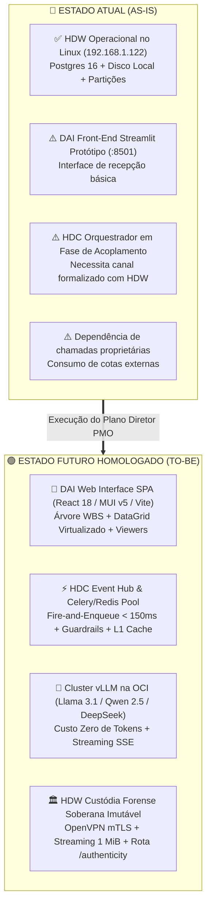
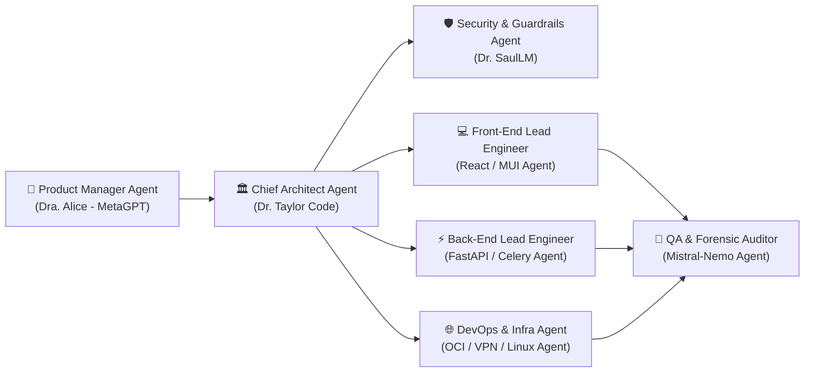
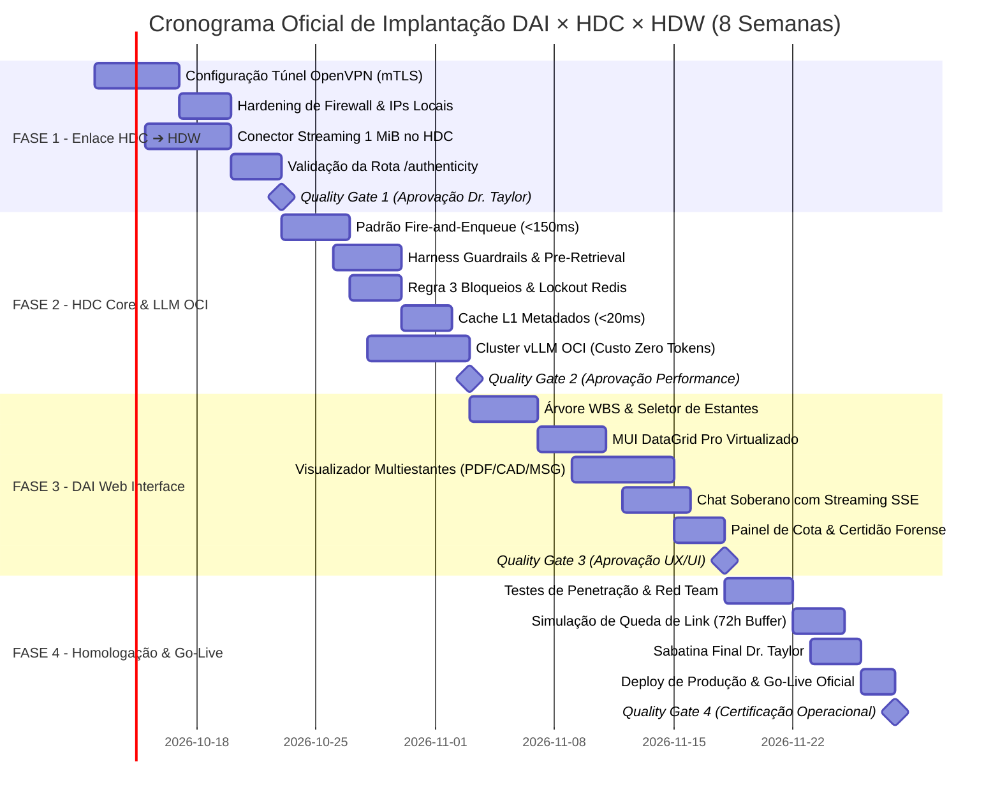

# 🎖️ PLANO DIRETOR DO PMO: DAI WEB INTERFACE × HDC × HDW
**Documento:** `PLANO_DIRETOR_PMO_DAI_HDC_HDW.md`  
**Autor:** PMO Central de Engenharia de Software, TI, Infraestrutura e Processos  
**Destinatário:** Dr. Taylor Code (Arquiteto-Chefe & Diretor Forense) e Corpo Clínico Multidisciplinar  
**Metodologia de Agentes:** MetaGPT Multi-Agent SOP Framework (Standard Operating Procedures)  
**Data de Emissão:** Outubro de 2026  
**Status:** ⚡ **ORDEM DE SERVIÇO EXECUTIVA — EMISSÃO IMEDIATA & OBRIGATÓRIA**

---

## 1. Pronunciamento do PMO & Diretriz Estratégica

> **"Atenção Dr. Taylor, Engenheiros de Software, Arquitetos de Nuvem e Operações de Infraestrutura:**  
> O HDW (Hudson Data Warehouse) **já está operacional e validado em ambiente Linux CentOS 7 local**. Não reinventaremos a roda nem desperdiçaremos ciclos de máquina. Nossa missão crítica agora é construir o acoplamento de alta fidelidade:
> 1. Conectar de forma inviolável o **HDC (Hudson Data Core) sobre o HDW local** via túnel seguro OpenVPN;
> 2. Construir a **Web Interface da DAI sobre o HDC**, entregando a experiência visual de alta densidade, o leitor multiestantes e o chat conversacional soberano na OCI a **custo zero de tokens**.  
> Todos os agentes MetaGPT estão convocados e alocados com papéis intransferíveis."

---

## 2. Diagnóstico Pericial do Estado Atual (As-Is ➔ To-Be)

| Componente | Estado Atual (As-Is) | Estado Alvo (To-Be) | Ação Requerida |
| :--- | :--- | :--- | :--- |
| **HDW Local** | Ativo em CentOS 7 (`192.168.1.122`) | Integrado via OpenVPN e X-API-Key | Configurar túnel mTLS e rota `/authenticity`. |
| **HDC Orquestrador** | Roteador básico na OCI | Event Hub assíncrono com Celery e Redis | Implementar Fire-and-Enqueue, L1 Cache e Guardrails. |
| **DAI Web Interface** | Streamlit funcional | SPA React 18 / TypeScript / MUI v5 | Construir componentes WBS, DataGrid e Viewers (PDF/CAD/MSG). |
| **Modelos de Linguagem** | APIs externas / testes locais | Cluster vLLM privado na OCI | Provisionar Llama 3.1 8B, Qwen 2.5 7B e DeepSeek R1 a Custo Zero. |

---

## 3. Matriz de Responsabilidade RACI & Alocação de Agentes MetaGPT

Utilizando o arcabouço **MetaGPT**, os papéis do sistema são atribuídos a agentes especializados com cadeias de entrega formais:

| Papel / Agente MetaGPT | Titular / Especialista | Atribuições Críticas | Matriz RACI |
| :--- | :--- | :--- | :---: |
| **Chief Architect & Custody** | **Dr. Taylor Code** | Governança da Custódia Soberana, validação das rotas `/authenticity`, integridade SHA-256 e DDLs PL/pgSQL. | **Accountable (A)** |
| **Product Manager (SOP)** | Dra. Alice (MetaGPT) | Quebra de épicos em user stories, validação de critérios de aceitação e fluxo do operador na portaria. | **Responsible (R)** |
| **Security & Compliance** | Dr. SaulLM (Jurídico/PAM) | Regra dos 3 Bloqueios (Lockout), assinaturas HMAC, injeção Pre-Retrieval e sigilo de cotas. | **Consulted (C)** |
| **Fuzzy & Data Verification** | Mistral-Nemo | Desambiguação de consultas humanas incompletas, resolução de entidades WBS e testes de estresse pericial. | **Consulted (C)** |
| **Front-End Engineering** | Lead React / MUI Agent | Construção da SPA (Árvore WBS, DataGrid Pro, Leitor PDF/CAD/MSG e Chat SSE). | **Responsible (R)** |
| **Back-End & Orchestration** | Lead FastAPI / Celery Agent| Fire-and-Enqueue (< 150 ms), filas Redis, conectores OpenVPN e streaming 1 MiB. | **Responsible (R)** |
| **Infra, Cloud & Network** | DevOps OCI / CentOS Agent | Subida da VPN 87.102.137.206:1194, vLLM na OCI, Caddy SSL e Circuit Breaker de 72h. | **Responsible (R)** |
| **PMO Executive Director** | PMO Central (Antigravity) | Auditoria de prazos, remoção de impedimentos, aprovação de gates e sincronização contínua. | **Informed (I)** |

---

## 4. Plano de Trabalho em Fases (WBS de Implantação)

O projeto está estruturado em **4 Fases Sequenciais**, com portões de qualidade (*Quality Gates*) mandatórios entre cada transição.

### 🔷 FASE 1: Conectividade Criptográfica & Enlace HDC ➔ HDW (Semanas 1 e 2)
*Objetivo: Estabelecer comunicação segura e de baixa latência entre a OCI e o servidor Linux local já existente.*
- **E1.1 — Túnel OpenVPN Corporativo:** Conectar o container HDC na OCI ao gateway `87.102.137.206:1194` (UDP) via mTLS, atribuindo IP virtual `10.8.0.2` (OCI) e `10.8.0.1` (CentOS 7).
- **E1.2 — Hardening de Firewall do HDW:** Restringir o serviço da porta `8080` no Linux local estritamente para o IP `10.8.0.2`, rejeitando qualquer outro IP externo.
- **E1.3 — Conector de Streaming (1 MiB):** Implementar no HDC o cliente HTTP/2 assíncrono (`httpx`) para transferir arquivos binários em blocos de 1 MiB sem carregar o arquivo na RAM.
- **E1.4 — Teste de Rota `/authenticity`:** Validação da checagem cruzada de hash SHA-256 no disco do CentOS 7 contra os registros das partições `custody_log_2025/2026/2027`.
- **Quality Gate 1:** *Ping VPN < 35 ms; Leitura de arquivo de 50 MB com pico de RAM no CentOS 7 inferior a 25 MB; Zero requisições não autorizadas aceitas.*

### 🔷 FASE 2: Orquestrador HDC, Celery, Redis & Infraestrutura LLM OCI (Semanas 3 e 4)
*Objetivo: Construir o motor assíncrono de eventos, guardrails de segurança e cluster de inteligência com custo zero.*
- **E2.1 — Padrão Fire-and-Enqueue:** Implementar no FastAPI do HDC a resposta `HTTP 202 Accepted` em menos de 150 ms com retorno imediato de `task_id`.
- **E2.2 — Harness de Guardrails Pre-Retrieval:** Injetar na camada de dados os filtros obrigatórios de WBS e nível de sigilo antes de qualquer consulta.
- **E2.3 — Regra dos 3 Bloqueios no Redis:** Implementar a contagem de falhas em janela deslizante de 15 minutos com trava atômica de 24h e emissão de alerta pericial.
- **E2.4 — Cache L1 de Metadados:** Armazenar nós de WBS e metadados de estantes em RAM no Redis, garantindo resposta em `< 20 ms`.
- **E2.5 — Provisionamento vLLM na OCI:** Configurar os modelos **Meta Llama 3.1 8B**, **Qwen 2.5 7B** e **DeepSeek R1/V2.5** na máquina Ampere A1 (24 GB RAM) da OCI, expondo porta local `:8000` para inferência sem custo de token.
- **Quality Gate 2:** *90% de cache hit no Redis para buscas de catálogo; latência do gateway HDC < 140 ms; inferência vLLM com vazão de > 25 tokens/s.*

### 🔷 FASE 3: Desenvolvimento da Web Interface DAI (Semanas 5 e 6)
*Objetivo: Construir a Single Page Application (SPA) em React 18 / MUI v5 para os operadores e auditores.*
- **E3.1 — Navegador WBS & Seletor de Estantes:** Implementar árvore dinâmica baseada na estrutura do empreendimento com carregamento sob demanda (*lazy-loading*).
- **E3.2 — Tabela Virtualizada (MUI DataGrid Pro):** Renderizar 50.000+ cotas com paginação server-side, ordenação remota e chips de classificação de sigilo.
- **E3.3 — Visualizador Multiestantes Integrado:**
  - PDF: Inserir camada de overlay amarelo OCR nos termos investigados.
  - CAD/BIM: Renderizar plantas DWG e modelos 3D IFC no navegador via WebGL sem necessidade de softwares proprietários.
  - E-mails: Visualizador de `.eml`/`.msg` com sanitização DOMPurify e painel de validação de SPF/DKIM.
- **E3.4 — Chat Conversacional em Streaming (SSE):** Conectar interface de chat ao endpoint vLLM da OCI com suporte a cancelamento de resposta via `AbortController`.
- **E3.5 — Modal de Certidão Forense:** Botão de emissão de atestado pericial com conferência do hash SHA-256 e geração de PDF com carimbo UTC e QR Code.
- **Quality Gate 3:** *LCP < 1.8s; INP < 120ms; Zero vulnerabilidades XSS no visualizador de e-mails; Chat streaming fluido sem travamento de UI.*

### 🔷 FASE 4: Integração E2E, Testes de Carga, Sabatina do Dr. Taylor & Go-Live (Semanas 7 e 8)
*Objetivo: Testar a esteira completa sob cenários adversos, homologar junto à governança e colocar em produção.*
- **E4.1 — Teste de Penetração & Red Team:** Simulação de ataques de injeção de prompt, tentativa de adulteração de hash e estouro de limite de requisições.
- **E4.2 — Teste de Resiliência do Link (Circuit Breaker):** Derrubar intencionalmente a conexão com o datacenter local por 4 horas e verificar a retenção das tarefas no Redis sem perda de dados.
- **E4.3 — Auditoria dos Triggers PL/pgSQL:** Tentativa formal de executar `UPDATE` ou `DELETE` no banco do HDW para comprovar o bloqueio pericial intransponível.
- **E4.4 — Homologação da Sabatina do Dr. Taylor:** Resolução dos casos complexos de recepção com ambiguidades humanas (Mistral-Nemo) e ordens judiciais de emergência (Dr. SaulLM).
- **E4.5 — Virada de Chave (Go-Live) & Telemetria:** Habilitação do tráfego oficial, monitoramento em tempo real via Prometheus/Grafana e plano de rollback ativo.
- **Quality Gate 4:** *100% dos testes E2E aprovados; Laudo de integridade do Dr. Taylor emitido; RPO = 0 comprovado.*

---

## 5. Cronologia Executiva & Diagrama de Gantt

---

## 6. Matriz de Riscos, Mitigações & Contingências

| Risco Identificado | Severidade | Probabilidade | Estratégia de Mitigação | Plano de Contingência |
| :--- | :---: | :---: | :--- | :--- |
| **Instabilidade do link de internet da sede da SUGOI** | Alta | Média | Circuit Breaker ativado no HDC com retenção no Redis em fila com persistência AOF. | Buffer de retenção por até 72h; sincronização cadenciada na restauração. |
| **Exaustão de disco no CentOS 7 (Limite 10 GB)** | Alta | Baixa | Deduplicação física por hash SHA-256 e expurgo imediato de temporários de upload. | Alerta em 80% de ocupação; bloqueio de novos uploads não-periciais mantendo apenas perícia. |
| **Pico de latência no vLLM da nuvem OCI** | Média | Baixa | Quantização AWQ 4-bit nos pesos e balanceamento entre Llama 3.1 8B e Qwen 2.5 7B. | Degradação graciosa para fallback leve de extração estruturada de entidades. |
| **Tentativa de injeção de prompt para vazar laudo** | Crítica | Média | Injeção de permissões no Pre-Retrieval (filtro SQL direto antes de tocar o modelo de linguagem). | O modelo sequer recebe o contexto confidencial; tentativa gera alerta de compliance. |
| **Concorrência em cliques rápidos na interface** | Média | Alta | Trava atômica `SETNX` no Redis via cabeçalho `X-Idempotency-Key` com expiração de 300s. | Rejeição automática com `HTTP 409` informando processamento em andamento. |

---

## 7. Critérios de Homologação (Definition of Done - DoD)

Uma funcionalidade só será considerada **HOMOLOGADA** pelo PMO e pelo Dr. Taylor mediante o cumprimento estrito dos seguintes requisitos:
1. ✅ **Determinismo Criptográfico:** Toda evidência tem cota única determinística `[ESTANTE]-[WBS]-[ANO]-[HASH8]` e hash conferido na rota `/authenticity`.
2. ✅ **Latência Contratual:** O HDC responde à interface DAI em `< 150 ms` em operações assíncronas e `< 20 ms` em leituras de cache L1.
3. ✅ **Custo Zero de Tokens:** 100% das inferências de triagem e chat ocorrem no cluster vLLM da nuvem privada OCI, sem chamadas a APIs pagas.
4. ✅ **Zero Corrupção Forense:** Triggers PL/pgSQL impedem qualquer alteração em `custody_log` mesmo sob comando direto de usuário administrativo.
5. ✅ **Resiliência a Quedas:** O ecossistema suporta interrupção de link entre OCI e sede por até 72 horas sem perda de dados enfileirados.
