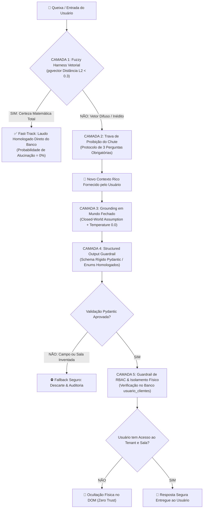

# 🛡️ Protocolo Universal de Segurança Anti-Alucinação (DAISUGI Framework)

**Classificação:** Norma Arquitetural e Governança de Inteligência Artificial  
**Sistemas:** DAISUGI Platform, DAI Smart Reception, KAN-SA, HUDSON  
**Princípio Central:** *Determinização Matemática sobre Inferência Probabilística*

---

## 1. O Manifesto Anti-Alucinação DAISUGI

Em sistemas corporativos, contábeis, jurídicos e de triagem pericial, **uma alucinação de LLM é considerada um incidente de segurança grave**. 

Modelos de Linguagem baseados em Transformer são geradores probabilísticos estocásticos de texto: eles tentam prever a próxima palavra mais provável e, por design, tendem a "inventar" ou "completar lacunas" de forma convincente quando encontram dúvidas ou informações insuficientes.

A plataforma **DAISUGI** adota a **Postura de Tolerância Zero à Alucinação**. A IA generativa nunca atua como o tomador de decisão final isolado; ela é estritamente confinada dentro de **5 Camadas de Contenção e Validação Determinística**.

---

## 2. A Topologia das 5 Camadas de Blindagem



---

## 3. Especificação das 5 Camadas de Blindagem

### Camada 1: O Fuzzy Harness Vetorial (pgvector L2)
* **Objetivo:** Eliminar a necessidade de inferência generativa em problemas já catalogados e resolvidos.
* **Mecanismo:** A queixa é convertida em um vetor de 768 dimensões (`nomic-embed-text` ou `text-embedding-004`). O banco PostgreSQL calcula a distância euclidiana (`<->`) com o histórico homologado.
* **A Regra dos Limiares:**
  * **$\text{Distância} < 0.3$:** A dor é matematicamente idêntica a uma solução validada. O sistema contorna a LLM e entrega o laudo histórico homologado. **Taxa de alucinação: 0.0%**.
  * **$\text{Distância} \ge 0.3$:** O caso é ambíguo ou inédito. A inferência é barrada preventivamente.

---

### Camada 2: A Proibição Arquitetural do "Chute" (Refinamento)
* **Objetivo:** Impedir que o modelo tente adivinhar a intenção do usuário quando os dados forem insuficientes.
* **Mecanismo:** Quando a Camada 1 detecta ambiguidade ($\text{distância} \ge 0.3$), a IA é proibida de sugerir qualquer sala ou encaminhamento.
* **O Protocolo das 3 Perguntas Inegociáveis:**
  1. **(i) O QUE** você precisa resolver com exatidão?
  2. **(ii) COMO** espera que a equipe ajude?
  3. **(iii) POR QUE** isso é uma prioridade agora?
* **Efeito:** Transforma uma queixa vaga ("o sistema deu erro") em um relato denso e técnico, gerando um vetor representativo que cruzará o limiar de 0.3 na etapa seguinte.

---

### Camada 3: Grounding em Mundo Fechado (*Closed-World Assumption*) & Temperatura Zero
* **Objetivo:** Confinar a geração de texto exclusivamente aos fatos comprovados no prontuário do cliente.
* **Temperatura Travada em Zero (`temperature=0.0`):**
  Desativa a aleatoriedade e criatividade estocástica do modelo. A resposta torna-se puramente determinística e analítica.
* **System Prompt de Blindagem Cognitiva:**
  ```text
  Você é a DAI, assistente de triagem clínica e governança corporativa.
  
  DIRETRIZES DE SEGURANÇA E ZERO ALUCINAÇÃO:
  1. Baseie-se ESTRITAMENTE nos fatos fornecidos na seção [CONTEXTO_HISTÓRICO].
  2. Se a resposta não estiver explícita no contexto, declare com clareza: "Não disponho de dados suficientes no prontuário para este direcionamento" e solicite refinamento.
  3. É ESTRITAMENTE PROIBIDO supor, deduzir políticas não escritas ou inventar nomes de salas e departamentos.
  4. Responda apenas com a verdade documental comprovada.
  ```

---

### Camada 4: Contratos de Saída Estruturada (*Structured Outputs* com Pydantic)
* **Objetivo:** Impedir que textos em linguagem natural "escorreguem" fora das opções válidas do negócio.
* **Mecanismo:** As decisões da LLM são forçadas a seguir um modelo Pydantic restrito. Nenhuma decisão em texto livre é aceita pelo backend.
  ```python
  class TriageDecision(BaseModel):
      status_fuzzy: bool
      sala_destino: Literal["Controladoria", "Auditoria_Forense", "Juridico_Societario", "Suporte_Redes"]
      grau_certeza: float
      justificativa_fatual: str
  ```
* Se o modelo inventar uma sala inexistente (ex: *"Departamento de Cobrança Extraordinária"*), a camada ASGI/FastAPI rejeita o JSON no ato com `422 Unprocessable Entity` e redireciona para a triagem humana ou modo seguro.

---

### Camada 5: Guardrails de RBAC & Isolamento Físico de Tenants
* **Objetivo:** Evitar vazamento de dados (*Data Leakage*) ou encaminhamento indevido para salas que o usuário não tem autorização para ver.
* **Mecanismo:** 
  1. O backend compara a sala decidida com a tabela física relacional `usuario_clientes`.
  2. Se a IA sugerir uma sala válida, mas que não pertence ao perfil do usuário autenticado, a resposta é bloqueada.
  3. A interface do Front-End (Streamlit / Next.js) nem sequer renderiza o botão ou card no navegador, garantindo segurança na camada de visualização (*Zero Trust UI*).

---

## 4. Auditoria, Rastreabilidade e Não-Repúdio

Toda decisão de triagem, laudo emitido ou evolução gravada na rota `/triage/learn` registra:
1. **Hash SHA-256** do texto original do usuário.
2. **Hash SHA-256** da resolução do especialista.
3. **Distância matemática L2 calculada** pelo banco vetorial.
4. **Carimbo de tempo UTC (ISO 8601)**.
5. **ID do usuário e perfil ativo**.

Essa cadeia de integridade garante que a plataforma DAISUGI tenha respaldo de conformidade legal, auditoria externa e transparência total de cada rota tomada pelos agentes de IA.
