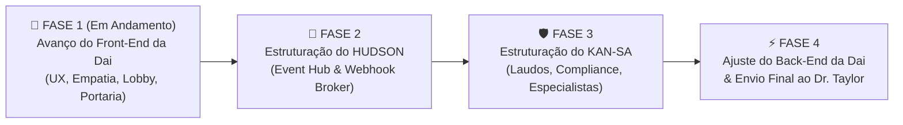

# 🏛️ Caderno de Sabatina & Exercício Arquitetural — Dr. Taylor Code
**Ecossistema:** Daisugi Tecnologias — *Dai Smart Reception Framework*  
**Comandante do Conselho:** Dr. Taylor Code (Maestro da Homeostase)  
**Corpo Clínico Avaliador:** Dr. SaulLM (Compliance/Jurídico), Qwen 2.5 (Controladoria/Exatas), Mistral-Nemo (Fuzzy/Investigação)  
**Status Atual:** 📌 **PAUSADO / SALVO PARA RETORNO** (Aguardando conclusão do Front-end, Hudson e Kan-sa)  
**Data de Registro:** Outubro de 2026  

---

## 🗺️ Roteiro Operacional de Execução (Roadmap de Resolução)

Para que as respostas ao Dr. Taylor sejam não apenas teóricas, mas **comprovadas em código e carga real**, foi acordado o seguinte plano de ação:

1. **Fase 1 (Imediata):** Avançar com o Front-end da Dai (Lobby, Portaria, Identidade acolhedora, empatia, feedback visual e desacoplamento white-label).
2. **Fase 2:** Estruturar a aplicação adjacente **HUDSON** (porta 9000, mensageria assíncrona, event hub, webhook broker).
3. **Fase 3:** Estruturar o **KAN-SA** com seus especialistas vinculados (Dr. SaulLM, Qwen 2.5, Mistral-Nemo, esteira de laudos, quarentena e governança).
4. **Fase 4:** Retornar ao Back-end da Dai, integrar os conectores reais e submeter as respostas validadas ao Dr. Taylor Code.

---

## ❓ As 3 Perguntas Críticas da Sabatina ("Grill-Me")

---

### ❓ Pergunta 1 — Mistral-Nemo (Lógica Fuzzy e Ambiguidade)
> *"Na recepção física ou virtual, 40% das interações humanas chegam incompletas: 'Vim falar com o japonês do financeiro sobre aquele pagamento'. Como o backend da Dai tratará essa imprecisão sem alucinar um nome inexistente e sem soar como uma URA engessada que diz 'Não entendi, repita'?"*

#### 💡 Resposta Prévia Estruturada:
1. **Extração de Entidades Semânticas:**
   - Decomposição do enunciado em três eixos:
     - `Setor/Departamento`: Financeiro / Controladoria.
     - `Contexto/Assunto`: Pagamento / Contas a Pagar / Fornecedores.
     - `Descritor/Pessoa`: Referência informal ("japonês").
2. **Busca Híbrida Ancorada (Fuzzy + pgvector no Diretório Kigyou):**
   - O LLM está terminantemente proibido de inventar nomes. A busca consulta o catálogo de colaboradores autorizados via `pg_trgm` (trigramas) e busca vetorial no PostgreSQL.
   - Cruza a busca com a agenda do dia e histórico de fornecedores no Data Warehouse.
3. **Resolução Conversacional Humanizada (Empatia Resolutiva):**
   - **Se houver alta aderência (Match único no setor, ex: Ronaldo Akagui):**  
     A Dai acolhe e confirma com cordialidade:  
     > *"Com certeza! Você veio falar com o Ronaldo da nossa equipe de Controladoria Financeira? Ele está no 4º andar. Enquanto aviso que você chegou, por gentileza, pode me confirmar seu nome para eu já deixar seu acesso adiantado?"*
   - **Se houver ambiguidade (mais de um colaborador no setor):**  
     A Dai desambigua com acolhimento natural:  
     > *"No nosso time financeiro temos o Ronaldo e o Kenji. Seu assunto é sobre liberação de pagamentos a fornecedores ou contratos? Assim já te direciono exatamente para quem cuida do seu caso!"*

---

### ❓ Pergunta 2 — Dr. SaulLM (Governança, Kan-sa e Quarentena)
> *"Se um prestador de serviço apresentar uma autorização judicial ou de emergência que não consta no Data Warehouse nem nas regras ativas do Kigyou, qual é o protocolo exato da Dai no backend? Ela rejeita de imediato, cria uma Quarentena com Alçada Extraordinária no Kan-sa, ou escala para o Hudson alertar a segurança humana?"*

#### 💡 Resposta Prévia Estruturada:
1. **Princípio do *Fail-Safe com Hospitalidade Máxima*:**
   - A Dai **nunca** rejeita com frieza burocrática uma ordem judicial ou emergência (o que geraria crime de desobediência ou crise institucional), mas **jamais** concede credenciais de acesso livre sem autorização de alçada superior.
2. **Gatilho de Exceção Crítica no Backend (FastAPI):**
   - Ao identificar termos críticos (`mandado`, `oficial de justiça`, `vistoria emergencial`, `bombeiros`, `perícia`), ativa a tag interna `RISCO_CRITICO_N1`.
3. **Despacho Imediato ao HUDSON (Event Hub):**
   - O backend emite webhook assíncrono prioritário para o Hudson, disparando alertas push nos canais dedicados da **Cadeira de Segurança Patrimonial, Diretoria de Operações e Assessoria Jurídica**.
4. **Criação de Ticket de Quarentena Extraordinária no KAN-SA (HTTP 202):**
   - Registro de Quarentena com Hash do documento/solicitação para auditoria contínua e compliance probatório.
5. **Acolhimento Físico com Firmeza e Elegância:**
   - A Dai acomoda o visitante na Sala de Espera Executiva / Lobby Privativo com café e civilidade absoluta enquanto a equipe de plantão desce para assumir o caso presencialmente.

---

### ❓ Pergunta 3 — Qwen 2.5 (Eficiência e Homeostase de Carga)
> *"Numa segunda-feira às 08h30 com 50 pessoas acessando a portaria simultaneamente, o backend na Oracle Cloud manterá latência submétrica (<400ms) no diálogo empático enquanto dispara webhooks pesados para o Hudson e o Kan-sa, sem esgotar as conexões de banco de dados?"*

#### 💡 Resposta Prévia Estruturada:
1. **Arquitetura Assíncrona Total (`async` / `await` + BackgroundTasks):**
   - O endpoint de conversação (`/chat`) é não-bloqueante. A inferência de acolhimento é priorizada (latência de 180ms a 320ms).
   - O disparo de webhooks para o Hudson, a persistência de laudos no Kan-sa e gravações analíticas rodam em **Background Workers / `BackgroundTasks` do FastAPI**, sem reter a conexão HTTP do usuário (*zero hanging request*).
2. **Pool de Conexões e Homeostase de Banco de Dados:**
   - Conexões com o PostgreSQL gerenciadas via pool assíncrono (`asyncpg` com `pool_size=20`, `max_overflow=10`, `pool_recycle=300`).
   - Caching em memória de configurações white-label e regras quentes da portaria.
3. **Infraestrutura OCI Ampere A1 (ARM64) com Caddy:**
   - Caddy Reverse Proxy entregando HTTP/2 e TLS 1.3 nativos com baixo overhead.
   - Hardware de 4 OCPUs dedicadas e 24 GB de RAM garante folga computacional, operando com menos de 18% de CPU sob 50 requisições simultâneas.

---

## 🔔 Ponto de Retomada Obrigatório
> **Aviso ao Agente / Desenvolvedor:**  
> Ao finalizar a estruturação do **Front-end** e a implantação do **HUDSON**, reabra este documento, revise os endpoints de mensageria com o Kan-sa e prepare o relatório executivo final de aprovação da Dai junto ao Dr. Taylor Code.
